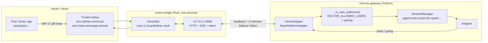
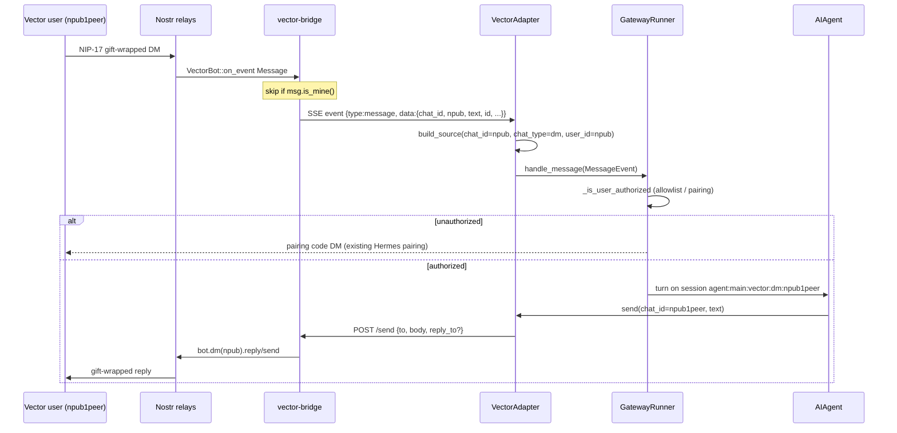
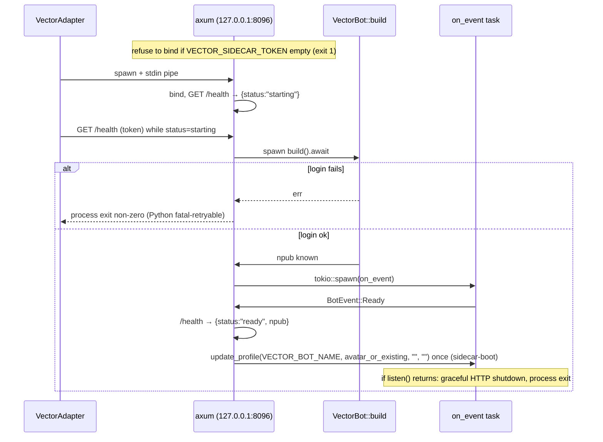
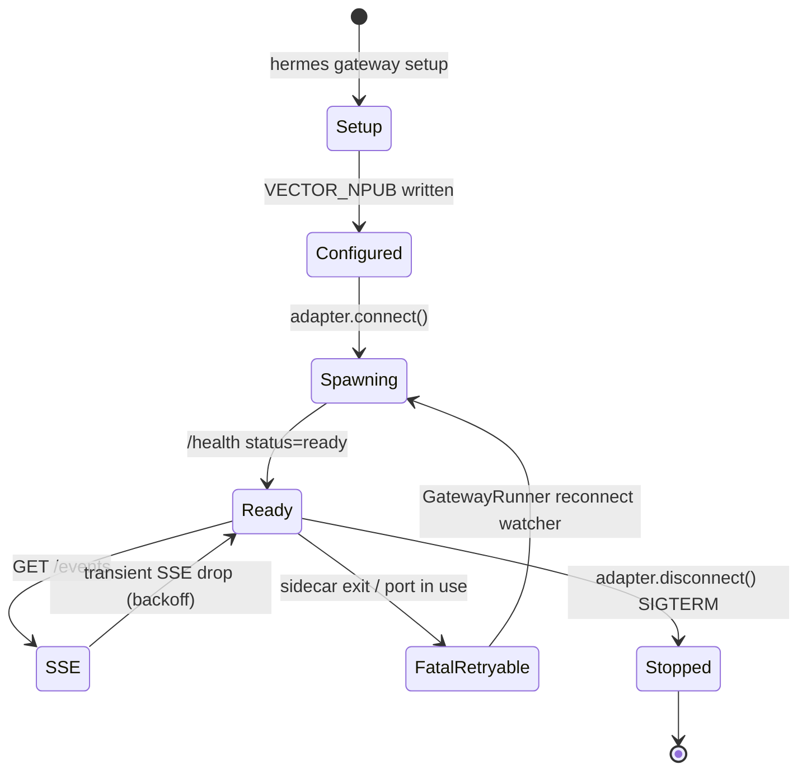

# Hermes Vector Platform Plugin — Design Document

| Field | Value |
| --- | --- |
| **Title** | Hermes Vector Platform: a first-class Vector bot identity for the Hermes gateway |
| **Author** | TBD |
| **Date** | 2026-08-28 |
| **Status** | Draft (revised 2026-08-29) |
| **Workspace** | `/home/anthony/projects/hermes-vector-platform` |
| **Hermes install** | `/home/anthony/.hermes/hermes-agent` (also `/home/anthony/projects/hermes-agent`) |
| **Vector SDK** | crates.io [`vector_sdk`](https://crates.io/crates/vector_sdk) `=0.9.0` (`vector-core` `0.8`). Publish SHA `b9aeb8d5` is on [VectorPrivacy/Vector](https://github.com/VectorPrivacy/Vector) `master`. crates.io `0.10.0` (SHA `7bf7d335`) is **not** on that remote and is not used. |

---

## Overview

Hermes Agent already talks to people through Telegram, Discord, Signal, and a growing set of *plugin* messaging adapters. Vector is a private encrypted messenger on Nostr (NIP-17 gift-wrapped DMs, Concord communities) with a first-class **Rust bot SDK** (`vector_sdk` `=0.9.0` on crates.io; `VectorBot`). There is **no Python SDK** in the Vector tree (verified: the only "python" hits in Vector are MIME mappings in `crates/vector-core/src/crypto/mod.rs`).

This document specifies a **user-installable Hermes platform plugin** (`kind: platform`) that gives Hermes **its own Vector identity** — a bot/agent npub that can DM other Vector users. The plugin is a first-class Vector participant, not a human impersonation layer. The recommended architecture is a **Python `BasePlatformAdapter` that owns a native sidecar process**, matching bundled Photon: the sidecar here is **Rust wrapping `vector-sdk`**, not Node wrapping a desktop library.

No Hermes core patches are required. Plugin platforms register through `PluginContext.register_platform` → `gateway.platform_registry.PlatformEntry`, and `Platform._missing_()` already accepts plugin names (`gateway/config.py`).

---

## Background & Motivation

### Why this exists

The operator wants Hermes reachable from Vector: a bot with its own public ID that a human Vector user can DM. Vector's product contract for that is the SDK, not the GUI:

> "Build a bot for Vector — a private, encrypted messenger — in about a dozen lines of Rust." — `crates/vector-sdk/README.md`

`VectorBot::builder().nsec(...).build()` logs in, reconnects across relay drops, and exposes `bot.dm(npub)`, `bot.on_message`, typing, files, reactions, and communities. `update_profile` always tags the account `bot: true` (`VectorBot::update_profile` docs in `lib.rs`). That is the identity we want Hermes to *be*.

### Current state

| Side | State |
| --- | --- |
| Hermes | Empty workspace at `/home/anthony/projects/hermes-vector-platform`. Plugin path is documented in `gateway/platforms/ADDING_A_PLATFORM.md` and `website/docs/developer-guide/adding-platform-adapters.md`. |
| Vector | Full SDK + `vector-agent` MCP server (`crates/vector-agent/`). MCP is the wrong control plane for a gateway adapter (pull/buffer, not inbound event dispatch). |
| Analog | Bundled Photon plugin (`plugins/platforms/photon/`): Python adapter + Node sidecar over loopback HTTP, **with a spawn-time auth token**. |

### Pain points this design absorbs

1. **Language gap.** Hermes plugins are Python. Vector's only supported bot API is a tokio `VectorBot` that **owns the process** (`lib.rs`: "one `VectorBot` owns the process's identity at a time"; `vector-core` is process-global).
2. **Secret handling.** An `nsec1…` is a full account. Vector persists it as plaintext `identity.nsec` with `0o600` (`load_or_create_identity` in `crates/vector-sdk/src/lib.rs`). Hermes `.env` is the usual secret store, but nsecs must never be logged and should not live in the plugin install tree (`plugins/plugin_storage.py`).
3. **Default-deny.** An agent inbox on a public-key network is spam/abuse-sensitive. Hermes `_is_user_authorized` already default-denies (`gateway/authz_mixin.py`). Vector's SDK `whitelist()` is **community-invite policy only**, not a DM filter — DM allowlisting is our job.
4. **Process death vs relay reconnect.** Sidecars crash. Hermes already reconnects retryable fatal adapters (`GatewayRunner._queue_retryable_fatal_platform` in `gateway/run.py`). Vector's SDK also reconnects *relays* while the process stays up. Those two loops must not be conflated: relay catch-up does **not** re-fire `on_event` for messages ingested while the sidecar process was dead (`prepare_listen` uses `NoOpEventHandler`).

---

## Goals & Non-Goals

### Goals (v1)

- Ship a standalone plugin the operator installs into `~/.hermes/plugins/vector-platform` (clone of this repo). Zero Hermes core diffs.
- The plugin **creates or imports a Vector bot identity**. After setup the operator sees a bech32 `npub1…` they can share. That npub is Hermes, not the operator's personal Vector account.
- Bidirectional **1:1 DMs** between that bot and allowlisted Vector users: inbound Vector → Hermes gateway session → agent turn → outbound Vector.
- First-run UX via `hermes gateway setup` (`setup_fn` on `PlatformEntry`): create/restore plus "your Vector npub".
- Default-deny inbox: `VECTOR_ALLOWED_USERS` + Hermes pairing codes. `VECTOR_ALLOW_ALL_USERS` is dev-only.
- Production process hygiene: localhost-only sidecar, spawn-time auth token, scoped platform lock on the bot npub, SIGTERM→SIGKILL teardown, retryable crash recovery.
- Unit tests that do not require a live Vector network.

### Non-goals (v1)

- ~~Communities / Concord channels~~ — join-first + mention-gated groups shipped; bot-owned create is opt-in (`VECTOR_CREATE_COMMUNITY`). Public invite links and `InvitePolicy::Public` stay out.
- Files, voice, custom emoji reactions, message edit/delete.
- ~~Slash-command manifests (`kind:10304`)~~ — Vector picker for Hermes `/approve` and `/deny` only (optional args). Concord admin is **not** on this surface (see `ADMIN_PLAN.md`).
- Tor (`vector_sdk` `tor` feature + `builder.tor()`). Document as v2.
- Impersonating a human Vector account as the primary mode. Importing an existing nsec is supported for recovery, not as "Hermes logs in as you."
- In-tree Hermes platform (`Platform.VECTOR` enum member, `toolsets.py` edits). Plugin auto-toolset `hermes-vector` already covers this (`toolsets.py` `resolve_toolset`, `hermes-<name>` branch).
- Publishing the sidecar itself to crates.io in v1 (consumes crates.io `vector_sdk` `=0.9.0`).
- Using `vector-agent` (MCP over stdio) as the Hermes transport.
- Attaching to a running Vector desktop / another live `VectorBot` (one identity per process; no SDK attach API).
- Dispatching DMs that arrived **while the sidecar process was down**. `sync_dms` / `Channel::history` ingest SQLite only; they do not re-fire `on_event`. v1 documents this; v1.1 may add an explicit history walk.
- Multi-bot-in-one-gateway. Vector forbids two identities per sidecar process; one plugin instance = one npub. Extra identities = extra gateway profiles / processes.
- Compiling Rust at gateway `connect()` time. `cargo build` belongs in `setup_fn` only.

---

## Key Decisions

| # | Decision | Rationale |
| --- | --- | --- |
| D1 | **Python adapter + Rust sidecar subprocess**, HTTP/JSON + SSE on `127.0.0.1`, spawn-time `X-Hermes-Sidecar-Token`. | Vector SDK is tokio + process-global; Hermes is Python. Photon already runs this topology. PyO3/FFI couples crash domains and fights `vector-core`'s "one identity per process." |
| D2 | **Plugin has its own nsec/npub.** Setup mints or imports. Public `VECTOR_NPUB` in `.env` at runtime. Secret is **SDK-owned** at `<VECTOR_DATA_DIR>/identity.nsec` (default `plugin-data/vector-platform/sdk/identity.nsec`, mode `0600`). **Runtime** is the only keyless `VectorBot::builder().data_dir(VECTOR_DATA_DIR).build()` (file already exists). `--check` / `--setup` must **not** call `build()` / `load_or_create_identity` — that helper **writes** a new nsec when the file is missing. | `load_or_create_identity` reads/writes `data_dir.join("identity.nsec")` only (`lib.rs` 1758–1771). Using it from `--check` before the create/import prompt would mint identity A and hide the import path. nsec is SDK identity material next to SQLite, **not** a Hermes `secret_scope` secret; `.env` holds `VECTOR_NPUB` only at runtime. |
| D3 | **DM session key = peer npub.** `chat_id = user_id = npub1…`, `chat_type = "dm"`. Hermes `build_session_key` then isolates each peer automatically. | `IncomingMessage.chat_id` for DMs *is* the sender npub (`vector-sdk` `BotEvent` docs). |
| D4 | **Default-deny allowlist at the adapter/gateway layer**, not Vector SDK `whitelist()`. Pairing codes enabled (`VECTOR_PAIRING` default on). SDK `whitelist()` is used only as **community-invite** policy (`VECTOR_TRUSTED_INVITERS` / `VECTOR_ALLOWED_USERS`). | SDK whitelist only gates **community invites** (`InvitePolicy`). DMs would otherwise be open to any npub that can gift-wrap to the bot. Hermes `_is_user_authorized` already default-denies. |
| D5 | **v1 is DM text + typing + profile (`bot: true`) plus mention-gated Concord channels.** Public invite links, `InvitePolicy::Public`, community files/reactions, and catch-up of messages missed while the sidecar was down stay later. | Smallest path that satisfies "the plugin has its own npub and can chat with another Vector user," then a private group room. |
| D6 | **Sidecar is a first-class crate in this repo** (`bridge/`), depending on crates.io **`vector_sdk = "=0.9.0"`** (crate name uses an underscore; pulls `vector-core` `0.8`). Exact pin — do not take crates.io `0.10.0`. Do not fork Vector. Do **not** use a git dep on `VectorPrivacy/Vector` — that repo has **no root `Cargo.toml`** (workspace is `crates/Cargo.toml`); Cargo git deps will not resolve. Do not use a sibling path `../../Vector/crates/vector-sdk` (operators and CI should not need a Vector checkout). Vector's workspace `[patch.crates-io]` for `nostr` does **not** inherit; consumers get stock `nostr` (vector-core README). There is **no plugin-root Cargo workspace** — the build command is `cd bridge && cargo build --release`, not `cargo build -p vector-bridge` from the repo root. | crates.io `0.9.0` publish SHA `b9aeb8d5` is an ancestor of GitHub `master`. crates.io `0.10.0` (2026-08-26, SHA `7bf7d335`) is **not** on that remote — treat as unpublished source and do not consume it. SDK README still documents `"0.3"`. |
| D7 | **Bind `127.0.0.1` + header `X-Hermes-Sidecar-Token` on every route including `/health`.** Cron `standalone_sender_fn` reads a 0600 runtime record for port+token (Photon pattern). No `Authorization: Bearer`. Optional unauthenticated `/live` returns `{ok:true}` only. | Unauthenticated loopback binds have been CVE-class bugs on other sidecars. Photon's header is `X-Hermes-Sidecar-Token` (`plugins/platforms/photon/sidecar/index.mjs`). One string everywhere. |
| D8 | **Do not use `vector-agent` MCP as the adapter.** | MCP is a tool server (`crates/vector-agent/src/main.rs` + `tools.rs`) that buffers inbound DMs for `get_new_messages`. Hermes gateway needs push (`handle_message`) plus `send()`. Wrong inversion of control. |
| D9 | **User plugin, not bundled.** `kind: platform` user plugins in `~/.hermes/plugins/` are gated by `plugins.enabled` (`hermes_cli/plugins.py` PluginManifest docs). Install = clone + enable + `hermes gateway setup`. Directory plugins **must** ship `__init__.py` exposing `register(ctx)`. | Third-party messengers stay out of Hermes core (plugin path is the supported shape). |
| D10 | **v1 builds the sidecar during `hermes gateway setup` (`cargo build --release` in `bridge/`).** No prebuilt binaries. `ensure_deps_fn` does **not** compile; it returns False + install hint. `check_fn` stays side-effect free. | Hermes calls `ensure_deps_fn` from `create_adapter()` at gateway start. A multi-minute `vector_sdk` compile would blow `VECTOR_STARTUP_TIMEOUT` and systemd limits. Photon installs Node deps in interactive setup, not `ensure_deps_fn`. This operator has rustc. Prebuilts are v1.1. |
| D11 | **Unattended start. No `VECTOR_PASSWORD` / PIN in v1.** Headless `build()` without `.password()`. | Argon2id is 150MB / 10 iterations (`crypto::hash_pass`). A PIN would block `hermes gateway start`. Encrypted-at-rest nsec is v1.1. |
| D12 | **Setup writes `display.platforms.vector.tool_progress: off` (and `interim_assistant_messages: false`) into the operator `config.yaml`.** There is no `display.platform_tool_progress` key. Resolution is `display.platforms.<platform>.tool_progress` → global `display.tool_progress` → `_PLATFORM_DEFAULTS` → `_GLOBAL_DEFAULTS["tool_progress"] = "all"` (`gateway/display_config.py`). `"vector"` is absent from `_PLATFORM_DEFAULTS` (adding it is a Hermes-core patch — a non-goal). A user plugin therefore inherits **`all`** unless setup writes the YAML override. Signal/Photon `_TIER_LOW` analog. Flip only when `/edit` ships (v1.1). | Vector *can* edit (`Channel::edit`); v1 has no `/edit` route. Without the override, Hermes posts a new Vector DM per tool event. |
| D13 | **Normalize npubs with `PublicKey::parse` (Rust sidecar) and `normalize_npub()` (Python, in `adapter.py`).** Python copies Buzz stdlib bech32 (`hex_to_npub` / `npub_to_hex` in `plugins/platforms/buzz/adapter.py`, charset `qpzry9x8gf2tvdw0s3jn54khce6mua7l`, 32-byte payload) plus strip `nostr:` / whitespace. Persist canonical `npub1…`. No Python crypto package. Do not use a loose `npub1[0-9a-z]{58,}` regex. Sidecar `/send` still re-validates with `PublicKey::parse`. **`parse_target_ref_fn` is `_parse_npub_target`**, which wraps `normalize_npub()` and returns `Optional[tuple[str, Optional[str]]]` (`(npub, None)`); never register `normalize_npub` as the hook (Hermes rejects a bare string). | Same approach as `VectorBotBuilder::whitelist` (`PublicKey::parse` + `to_bech32`). Buzz already ships a stdlib codec. `PlatformEntry.parse_target_ref_fn` is a `(chat_id, thread_id)` tuple (`gateway/platform_registry.py`). |
| D14 | **Public kind-0 is opt-in.** Sidecar-boot calls `update_profile` **only** when `VECTOR_BOT_NAME`, `VECTOR_BOT_ABOUT`, `VECTOR_BOT_AVATAR`, and/or `VECTOR_BOT_BANNER` is set. Unset/blank = do not publish (no default name `Hermes` on the wire). When publishing: name/about from env; avatar/banner from `upload_image` public Blossom URLs or previously published URLs; `bot: true`. Empty strings passed to the SDK **merge** (they keep prior kind-0 fields); they do not wipe a card already on relays. NIP-24 extras (`display_name`, `website`, `nip05`, `lud16`) are not settable via Vector `update_profile`. Do not use `"Hermes Agent"`. Do not leak hostname or `HERMES_HOME`. | Operator decision 2026-08-28 / 2026-08-30 (opt-in kind-0). Kind-0 is public. |
| D15 | **v1 uses SDK `state::TRUSTED_RELAYS` only.** No `VECTOR_RELAYS` env or builder override. Relays: `wss://jskitty.com/nostr`, `wss://asia.vectorapp.io/nostr`, `wss://nostr.computingcache.com`, `wss://relay.ditto.pub` (`vector-core/src/state.rs`). | Operator decision 2026-08-28. A custom relay list is a later knob if those endpoints are unreachable. |

---

## Proposed Design

### Architecture



End-to-end inbound:



### Repository layout (new project)

```
/home/anthony/projects/hermes-vector-platform/
  plugin.yaml                 # kind: platform, name: vector-platform
  pyproject.toml              # optional pip entry point hermes_agent.plugins
  __init__.py                 # re-exports adapter.register (required for ~/.hermes/plugins/)
  adapter.py                  # VectorAdapter + register(ctx)
  README.md
  LICENSE
  CHANGELOG.md
  tests/test_plugin_unit.py
  .github/workflows/ci.yml    # cd bridge && cargo test/build --locked; pytest
  bridge/
    Cargo.toml                # vector_sdk = "=0.9.0" (crates.io)
    src/main.rs               # CLI + axum server + VectorBot task
    src/api.rs                # request/response types, auth, errors
    src/events.rs             # single-client SSE from BotEvent
```

Install target (operator machine): `~/.hermes/plugins/vector-platform`.

Durable data (never in the install tree):

```
~/.hermes/plugin-data/vector-platform/
  sdk/                          # VECTOR_DATA_DIR — VectorBot::data_dir
    identity.nsec               # 0600; written by --setup; runtime build() reads it
    identity.mnemonic           # 0600; written on create / mnemonic import; backup only
    <sqlite + caches>           # vector-core::db; wipe these, never identity.nsec
~/.hermes/runtime/vector-sidecar.json   # {port, token, pid, npub} 0600
~/.hermes/logs/vector-bridge.log
~/.hermes/.env                  # VECTOR_NPUB, VECTOR_ALLOWED_USERS, VECTOR_HOME_CHANNEL, …
```

`plugins/plugin_storage.py`:

> "Don't invent paths inside `<hermes home>/plugins/<name>/`. That tree is the install dir — `hermes plugins remove` deletes it."
>
> "Secrets are deliberately NOT part of this convention — credential reads go through `agent.secret_scope` / `.env`."

Use `plugin_data_dir("vector-platform") / "sdk"` as `VECTOR_DATA_DIR`. **Exception:** `identity.nsec` is SDK identity material stored next to SDK SQLite (mode `0600`), not a Hermes secret-source. `.env` holds only `VECTOR_NPUB` at runtime. Do not put the nsec in `.env` after setup.

### Process topology (question 1)

#### Recommendation: Python adapter + Rust sidecar (HTTP/SSE)

This is Photon's sidecar topology with the native side swapped from Node to Rust.

| Concern | How it is handled |
| --- | --- |
| Language | Sidecar is a normal `#[tokio::main]` binary using `VectorBot` exactly as `echo_bot.rs` / `ai_bot.rs` do. |
| Process-global Vector state | Satisfied: **one bot per sidecar process**, as `vector-sdk` requires. |
| Crash isolation | A panic in `vector-core` kills the sidecar, not the gateway. Adapter observes `Popen.poll()`, calls `_set_fatal_error(..., retryable=True)`. Gateway queues reconnect (`_queue_retryable_fatal_platform`). |
| Event loop | Tokio lives in the sidecar. Python asyncio talks HTTP/SSE via `httpx.AsyncClient`. |
| Lifecycle | `connect()` spawns with `stdin=PIPE` + `VECTOR_SIDECAR_WATCH_STDIN=1`; `disconnect()` closes stdin, then SIGTERM process group, then SIGKILL (`os.setsid` / `killpg`). |
| Cron | `standalone_sender_fn` POSTs to the live sidecar. Cron does **not** spawn its own bot (the Hermes gateway must be running). |
| Parent-death | v1 **required**. Copy Photon: adapter holds the stdin pipe; sidecar exits on stdin EOF (`PHOTON_SIDECAR_WATCH_STDIN` in `plugins/platforms/photon/sidecar/index.mjs`). Linux `PR_SET_PDEATHSIG(SIGTERM)` is additional, not the primary mechanism. **No idle-exit timer in v1.** |

Sidecar spawn (conceptual, process group + Photon stdin watch):

```python
# adapter.py
def _spawn_bridge(self) -> subprocess.Popen:
    bin_path = resolve_bridge_bin()  # VECTOR_BRIDGE_BIN or bridge/target/release/vector-bridge
    env = {
        **os.environ,
        "VECTOR_DATA_DIR": str(self.data_dir),          # plugin-data/.../sdk  (== SDK data_dir)
        "VECTOR_BRIDGE_PORT": str(self.bridge_port),
        "VECTOR_BRIDGE_HOST": self.bridge_host,         # default 127.0.0.1
        "VECTOR_SIDECAR_TOKEN": self._sidecar_token,    # generated at connect(); never nsec
        "VECTOR_BOT_NAME": self.bot_name,
        "VECTOR_SIDECAR_WATCH_STDIN": "1",
    }
    env.pop("VECTOR_NSEC", None)
    env.pop("VECTOR_MNEMONIC", None)
    return subprocess.Popen(
        [str(bin_path)],
        env=env,
        stdin=subprocess.PIPE,           # parent-death: sidecar exits on EOF
        stdout=self._bridge_log_fh,      # not PIPE — avoids OS pipe-buffer deadlock
        stderr=self._bridge_log_fh,
        preexec_fn=os.setsid,
    )
```

Default port **8096** (Photon uses 8789). Override with `VECTOR_BRIDGE_PORT`. Default host `127.0.0.1` (`VECTOR_BRIDGE_HOST`).

#### Alternative A — PyO3 extension module (rejected for v1)

Build `vector-sdk` into a `cdylib`, expose `VectorBot` to Python.

- **Pros:** No extra process; in-memory calls; no HTTP schema.
- **Cons (fatal for v1):**
  1. `vector-core` process-global state (`crates/vector-core/README.md`: "one account is active per process"). The Hermes gateway process would be able to host **exactly one** Vector identity, and a second profile/plugin could corrupt it via `swap_session`.
  2. Tokio runtime vs asyncio: you still need a background thread and a bridge. PyO3-asyncio is real work and a source of shutdown deadlocks.
  3. A native SIGSEGV / panic unwinding through the CPython ABI takes down the **entire gateway** (Telegram, Discord, cron, …).
  4. Wheel matrix (manylinux, musl, macOS, aarch64) plus `rust-version = "1.75"` (`vector-sdk/Cargo.toml`). A single sidecar binary is simpler than a Python extension.
  5. Vector's `GuardedKey` vault is designed around a dedicated process. Linux `PR_SET_DUMPABLE=0` is applied in the **GUI** crate (`src-tauri/src/lib.rs`), not in `vector-sdk`; a sidecar would still have to set it itself. Embedding the vault in CPython is a threat-model mismatch.

Keep PyO3 as a v3 experiment only if sidecar overhead becomes measurable. For a DM bot it will not.

#### Alternative B — C FFI / JSON-over-stdin (rejected)

A `extern "C"` surface still needs a live tokio loop. Stdio JSON-RPC (what `vector-agent` does for MCP) serializes poorly with SSE-style inbound streams and fights Hermes' existing HTTP/SSE adapter pattern. More custom protocol, same process split.

#### Alternative C — Python-only (impossible)

No Python Vector SDK exists. Reimplementing NIP-17/NIP-44/NIP-59 + Concord in Python would be a second messenger, not a plugin.

#### Alternative D — Drive `vector-agent` MCP from the adapter (rejected)

`crates/vector-agent/src/main.rs` logs in with `VECTOR_NSEC`, `listen()`s into a mutex `Vec<BufferedMessage>`, and serves MCP tools (`SendDmRequest`, `GetMessagesRequest`, …). Hermes would have to poll `get_new_messages`. That inverts the gateway (which is push via `handle_message`) and still requires a Rust subprocess. Worse latency, worse backpressure, extra protocol.

### Sidecar HTTP contract

Modeled on Photon's sidecar (health, SSE `/events`, POST `/send`, typing, `--setup`/`--check`) plus `X-Hermes-Sidecar-Token`. HTTP server: **axum** (tokio-native, one framework — not a PR-3 debate). JSON via serde. Max request body **64 KiB** (413 above that).

#### Boot sequence (required)

`VectorBot::on_event` **blocks until disconnect** (`self.core.listen(...).await`). It is not `main`. The process must bind HTTP *before* login so Python's 30s poll can tell "starting" from "hung":



Rules:

1. **Token required at process start.** If `VECTOR_SIDECAR_TOKEN` is empty, print to stderr and `exit(1)` (Photon). Do not bind.
2. Bind `VECTOR_BRIDGE_HOST:VECTOR_BRIDGE_PORT` **before** `VectorBot::build`. Serve `{status:"starting"}` on authenticated `/health` (npub omitted until login).
3. Run `build().await` on a task. Login failure → non-zero exit (Python `_handle_bridge_exit` / retryable fatal).
4. Spawn `on_event` as a **background** task. When `listen()` returns, shut down the axum server and exit the process. Do not leave a zombie HTTP listener.
5. Flip `/health` to `{status:"ready", npub}` as soon as `VectorBot::build` succeeds (nsec loaded, send is possible). Do **not** register Vector slash commands before `on_event`: SDK `prepare_listen` would publish kind-10304 to discovery relays *before* Ready (20–40s) and overrun Hermes' 30s connect wrap. Register + background-publish from `BotEvent::Ready`. Profile + missed-react stay on Ready. The adapter floors `HERMES_GATEWAY_PLATFORM_CONNECT_TIMEOUT` to 90s when unset.
6. **`update_profile` is sidecar-boot and opt-in** (D14): called only when `VECTOR_BOT_NAME`, `VECTOR_BOT_ABOUT`, `VECTOR_BOT_AVATAR`, and/or `VECTOR_BOT_BANNER` is set. SDK still tags `bot: true` when we do publish. Python `POST /profile` is optional; do not call it from `connect()` (avoids a race with Ready).
7. Stdin EOF (`VECTOR_SIDECAR_WATCH_STDIN=1`) triggers the same graceful shutdown as `listen()` return.

#### Auth

Every route **except** `GET /live` requires header `X-Hermes-Sidecar-Token: <token>` (Photon name; **not** `Authorization: Bearer`). Missing/wrong token → `401` `{error, code:"unauthorized"}`. Token is 32 random bytes, hex-encoded, generated in Python `connect()`, passed only via child env, persisted to `~/.hermes/runtime/vector-sidecar.json` with `0600` after `/health` says `ready` (Photon `_write_runtime_record`). Delete the record on disconnect.

`GET /live` is the only unauthenticated probe: `{ok:true}`. It does **not** include npub. Python's 30s liveness ping uses authenticated `/health` so it would count as activity if an idle timer ever returned (v1 has **no** idle-exit).

**Bind:** `VECTOR_BRIDGE_HOST` default `127.0.0.1`. Log a warning if it is not a loopback address. Document LAN risk in README (`plugin.yaml` optional_env). Token is still required.

#### Routes

| Method | Path | Auth | Body | Response |
| --- | --- | --- | --- | --- |
| GET | `/live` | none | | `{ok: true}` |
| GET | `/health` | token | | `{status: "starting"\|"ready", npub?}` |
| GET | `/npub` | token | | `{npub}` or 503 if not ready |
| GET | `/events` | token | SSE | see below |
| POST | `/send` | token | `{to, body, reply_to?}` | `{id}` or 400/503 |
| POST | `/typing` | token | `{to}` | `{ok: true}` |
| POST | `/profile` | token | `{name?, about?, avatar_path?, banner_path?}` | `{ok: true}` — `update_profile` (forces `bot: true`). Image paths are absolute local files; omitted keeps the published picture/banner. `GET /profile` (peer fetch) stays 501. |

v1.1 additions (stub the routes in v1, return `501` `{error, code:"not_implemented"}`): `/react`, `/send-file`, `/download-attachment`, `/block`, **`GET /profile?npub=`** (`VectorBot::fetch_profile` → `{name, about, …}`; used by `get_chat_info`). There is **no** profile-fetch route in v1 — `POST /profile` is self-rename only.

**Error body** (all non-2xx JSON): `{ "error": "<human>", "code": "<snake>" }`. `Content-Type: application/json`. Codes: `unauthorized`, `bad_request`, `invalid_npub`, `not_ready`, `payload_too_large`, `not_implemented`, `internal`. HTTP status: 401 / 400 / 400 / 503 / 413 / 501 / 500. `POST /send` before Ready is 503 `not_ready`. Invalid `to` after `PublicKey::parse` fails is 400 `invalid_npub`.

#### SSE

- **Single client**, last-writer-wins. A second `GET /events` ends the previous stream. Cron does not subscribe.
- Heartbeat: SSE comment `: ping\n\n` every 30s. Adapter stale-timeout 60s (2× ping).
- Each `message` event carries SSE `id: <message.id>` (Vector rumor/event hex). Adapter may send `Last-Event-ID` on reconnect; v1 sidecar **may ignore it** (live-only). Adapter **dedupes inbound by `data.id`** (in-memory LRU, ~1024) so SSE reconnect does not double-dispatch.
- `is_group: true` events are **dropped in the sidecar** in v1 (debug log). Do not SSE them.

Message mapping from `IncomingMessage` (there is **no** `IncomingMessage.npub` field):

| SSE `data` key | Source |
| --- | --- |
| `id` | `incoming.message.id` |
| `chat_id` | `incoming.chat_id` (DM = sender npub) |
| `npub` | `incoming.message.npub.clone().unwrap_or_else(\|\| incoming.chat_id.clone())` |
| `is_group` | `incoming.is_group` |
| `is_mine` | `incoming.is_mine()` / `incoming.message.mine` |
| `is_file` | `incoming.is_file` |
| `text` | `incoming.text()` (`incoming.message.content`) |
| `reply_to` | `incoming.message.replied_to` |
| `reply_to_text` | `incoming.message.replied_to_content` |
| `at_ms` | `incoming.message.at` (unix **milliseconds**, `Cursor.at_ms`) |

```json
{
  "type": "message",
  "data": {
    "id": "<event hex>",
    "chat_id": "npub1peer…",
    "npub": "npub1peer…",
    "is_group": false,
    "is_mine": false,
    "is_file": false,
    "text": "hello",
    "reply_to": "",
    "reply_to_text": null,
    "at_ms": 1785979414499
  }
}
```

Adapter `MessageEvent.reply_to_text` comes from `reply_to_text`. Skip SSE events with `is_mine: true`.

#### Setup modes

`--setup` / `--check` are **short-lived CLI processes**. They do not take `VECTOR_SIDECAR_TOKEN` and do not bind HTTP. They never print nsec. They **must not** call `VectorBot::build()`, `load_or_create_identity` (private; **writes** `identity.nsec` when missing — `crates/vector-sdk/src/lib.rs` 1758–1771), `VectorCore::init`+`login`, or connect relays. `--check` is a read-only file probe with no create.

- `--check` (side-effect free on the secret): if `<VECTOR_DATA_DIR>/identity.nsec` is missing or empty → print `{status: "not_registered"}` and exit 0. Else read the file, parse with `SecretKey::from_bech32` / `Keys::new`, print `{status: "existing", npub}` from `public_key().to_bech32()`, exit. Invalid bech32 → exit non-zero with `{error, code:"invalid_nsec"}` on stderr, **do not rewrite the file**.
- `--setup` **writes the file itself**, then derives npub the same offline way (no relays):
  - If `identity.nsec` exists and is non-empty → same parse as `--check`, print `{status: "existing", npub}`. Do not mint.
  - Else if `--nsec-file <path>` → copy/validate contents into `identity.nsec` (`restrict_to_owner` 0600), print `{status: "restored", npub}`.
  - Else if `--mnemonic-file <path>` → `Keys::from_mnemonic`, write the derived nsec to `identity.nsec` and the phrase to `identity.mnemonic` (both 0600), print `{status: "restored", npub}`.
  - Else → generate a 12-word BIP-39 mnemonic (`bip39::Mnemonic::generate(12)`), derive nsec via NIP-06 `Keys::from_mnemonic`, write `identity.nsec` and `identity.mnemonic` (both 0600), print `{status: "created", npub}`. Do not put the mnemonic in stdout JSON (same as nsec).
  - **Never print the nsec to stdout.** Backup path goes to stderr once, matching SDK `eprintln!("[vector-sdk] Created a new bot identity {} (stored at {})…")`.
- **Never pass nsec/mnemonic via environment into the long-running sidecar.** Setup may read a one-shot file and delete it after restore. If the operator still has `VECTOR_NSEC` in `.env` from a previous attempt, `interactive_setup` copies it to `identity.nsec` via `--nsec-file` then tells them to delete the env var.

**Runtime is the only keyless `build()`:** `VectorBot::builder().data_dir(&vector_data_dir).build().await?` with **no** `.nsec()` — SDK `load_or_create_identity` then sees a file `--setup` already wrote, so it will **not** mint. `InvitePolicy::Manual`. Relay reconnection is internal (`vector-sdk` README: "if the bot loses its connection, it reconnects on its own"). That loop is **not** process-death recovery. Python health monitor pings authenticated `/health` every 30s.

Wizard order depends on this: `--check` runs **before** the create/import prompt. If `--check` minted, first-run would always be `existing` and the import path would be dead.

### Identity (question 2)

#### Where the nsec is generated

`bip39::Mnemonic::generate(12)` → `Keys::from_mnemonic` (NIP-06) → `secret_key().to_bech32()`. Called only from sidecar `--setup` when no identity exists and no import was provided. Persist `identity.nsec` (runtime) and `identity.mnemonic` (backup) at `0600`. Nsec-only import writes nsec only.

#### Where it is stored

| Location | What | Why |
| --- | --- | --- |
| `plugin_data_dir("vector-platform") / "sdk" / "identity.nsec"` | nsec, mode `0600` | **This is `VECTOR_DATA_DIR/identity.nsec`.** `--check` only *reads* it (offline parse). `--setup` *writes* it (generate / copy file). Runtime `load_or_create_identity` then finds it and does not mint. Same `data_dir` everywhere. Survives plugin update/remove. |
| Same dir `identity.mnemonic` | 12-word BIP-39, mode `0600` | Written on create and mnemonic import. Backup only; runtime does not read it. Nsec-only import omits this file. |
| Same dir, other files | SQLite + Vector caches | Wipe caches by deleting SQLite/cache files, **never** `identity.nsec`. |
| `~/.hermes/.env` `VECTOR_NPUB` | public npub | Operator-visible; `requires_env` in `plugin.yaml`; `hermes gateway status`. |
| `~/.hermes/.env` `VECTOR_NSEC` | **optional, password=true, not read by the sidecar** | Import-only convenience for setup. `interactive_setup` copies it into `identity.nsec` via `--nsec-file`, then the operator should delete it from `.env`. |

**Never:** log nsec/mnemonic; pass nsec on argv; put nsec in the sidecar's environment; commit it; put it under `~/.hermes/plugins/vector-platform/`.

This is a deliberate exception to `plugin_storage.py` ("Secrets are deliberately NOT part of this convention"): nsec is SDK identity material stored next to SDK SQLite, mode `0600`, not a Hermes `secret_scope` secret. `.env` holds only `VECTOR_NPUB` at runtime.

In-memory, Vector XOR-splits the key across 128 decoy arrays (`crates/vector-core/src/crypto/guarded_key.rs`) — that **does** apply in the sidecar. Linux `PR_SET_DUMPABLE=0` does **not**: it is set only in the GUI crate `src-tauri/src/lib.rs`. Sidecar `main` must call `prctl(PR_SET_DUMPABLE, 0)` itself on Linux release builds.

v1.1: `VECTOR_PASSWORD` for encrypted-at-rest keys (`VectorBotBuilder::password`). Not in v1 (D11).

#### How the npub is exposed

1. Setup prints it and writes `VECTOR_NPUB`.
2. `GET /npub` and `/health` return it.
3. Adapter logs a **truncated** form (`npub1abcd…`) on connect.
4. `hermes gateway status` via `env_enablement_fn` seeding `PlatformConfig.extra["npub"]`.

#### Pairing / first-run UX

`interactive_setup()` registered as `setup_fn`. Flow:

1. Resolve `vector-bridge` binary (`VECTOR_BRIDGE_BIN`, else `bridge/target/release/vector-bridge`). If missing, `cargo build --release` in `bridge/` (requires `rustc >= 1.75`). If cargo is missing, print a clear install hint — do not silently pip-install anything (`check_fn` must stay side-effect free; **build belongs only in `setup_fn`**, never `ensure_deps_fn` / `connect()`).
2. `--check` against `VECTOR_DATA_DIR` (default `plugin-data/vector-platform/sdk`). This is **read-only**: `not_registered` vs `existing`. It must not mint (see Setup modes).
3. If `existing`: show the npub; skip create/import unless the operator confirms reconfigure (and understands replacing `identity.nsec` is a new bot). If `not_registered`: prompt create new identity / import nsec / import 12-word mnemonic. Import writes a temp `0600` file and passes `--nsec-file` / `--mnemonic-file`; never puts the secret in the sidecar env. **Create** writes `identity.nsec` and `identity.mnemonic`.
4. Prompt: bot display name (default `Hermes`).
5. Prompt: **operator's Vector npub** (hex / `npub1` / `nostr:npub1`, run through `normalize_npub()` — D13) — this becomes `VECTOR_HOME_CHANNEL` and the initial `VECTOR_ALLOWED_USERS`.
6. Prompt pairing policy: keep `VECTOR_PAIRING` on (default) or off (pre-filter unauthorized senders before `handle_message`, so pairing codes are not sent).
7. Run `--setup` (writes `identity.nsec` if missing; never `build()`). Save `VECTOR_NPUB`, `VECTOR_HOME_CHANNEL`, `VECTOR_ALLOWED_USERS`, `VECTOR_DATA_DIR`. Do not save nsec or mnemonic to `.env`. On create, `identity.mnemonic` is written next to the nsec.
8. Merge into `~/.hermes/config.yaml` (no core diff; D12):

```yaml
display:
  platforms:
    vector:
      tool_progress: off
      interim_assistant_messages: false
```

   README documents the same block. Do not invent `display.platform_tool_progress`.
9. Tell the operator: "Share this npub with contacts. Back up `sdk/identity.nsec` offline. Restart the gateway."

Hermes pairing (`gateway/pairing.py`) already falls back to `platform_registry.get(platform).allowed_users_env`. Setting `allowed_users_env="VECTOR_ALLOWED_USERS"` is sufficient: an unknown npub DMing the bot gets an 8-char pairing code; `hermes pairing approve` appends them to the allowlist env. No Vector-specific pairing store.

Scoped lock on connect:

```python
self._acquire_platform_lock(
    scope="vector-npub",
    identity=npub,
    resource_desc="Vector bot identity (npub)",
)
```

Scoped platform lock on the bot npub (prevents two gateway profiles using the same nsec).

### Hermes session mapping (question 3)

Hermes session keys are built by `build_session_key` in `gateway/session.py`. For `chat_type == "dm"` the key includes `platform`, `chat_id`, and optional `thread_id`.

| Vector concept | Hermes `SessionSource` field | v1 value |
| --- | --- | --- |
| Bot's own identity | (adapter state, not source) | `VECTOR_NPUB` |
| DM peer | `chat_id` | peer `npub1…` |
| DM peer | `user_id` | same npub |
| Display | `user_name` / `chat_name` | **v1:** truncated npub (`npub1abcd…`). **v1.1:** profile name from `GET /profile?npub=` → `VectorBot::fetch_profile` |
| Chat kind | `chat_type` | `"dm"` |
| Platform | `platform` | `Platform("vector")` (dynamic enum member) |
| Vector message id | `message_id` | rumor/event hex |

Resulting session key (default profile):

```
agent:main:vector:dm:npub1…
```

Each peer npub is its own Hermes conversation. That is the correct multi-user mapping: the operator can allowlist N people; each gets an isolated agent thread.

**Do not** collapse all Vector DMs into one session. **Do not** use the bot's own npub as `chat_id`.

v2 communities: `chat_id` = 64-char hex channel id (`ChannelKind::Community` detection in `channel_kind_for`), `chat_type` = `"group"`, `user_id` = sender npub, `parent_chat_id` / `scope_id` = community id. Mention-gate (`_mentions_bot` / reply-to-bot; `@everyone` ignored). Membership from a trusted invite is the look-gate (no `VECTOR_GROUP_ALLOWED_CHATS`). Group people-gate is a union: `VECTOR_ALLOWED_USERS` (also DMs), `VECTOR_GROUP_ALLOWED_USERS` (group-only, no DMs), or any member if the channel is in `VECTOR_GROUP_ALLOW_ALL`. Pairing stays DM-only. Channel ids are not shown in the Vector app; on join the sidecar logs the full hex and the adapter DMs `VECTOR_HOME_CHANNEL` once (`sdk/notified-channels.json`). Parked invites stay silent.

`normalize_npub()` (D13) returns `Optional[str]` for the wizard, allowlists, and `VECTOR_HOME_CHANNEL`. It is **not** the platform hook. `PlatformEntry.parse_target_ref_fn` is `(target_ref: str) -> Optional[tuple[str, Optional[str]]]` (`gateway/platform_registry.py`); `tools/send_message_tool.py` rejects a non-tuple with “Target parser … returned an invalid result”. Register the wrapper:

```python
# Copied from plugins/platforms/buzz/adapter.py (hex_to_npub / npub_to_hex;
# charset qpzry9x8gf2tvdw0s3jn54khce6mua7l). No nostr pip dep.
def normalize_npub(ref: str) -> Optional[str]:
    raw = (ref or "").strip()
    if raw.lower().startswith("nostr:"):
        raw = raw[6:].strip()
    if raw.lower().startswith("npub1"):
        hx = npub_to_hex(raw)
        return hex_to_npub(hx) if hx else None
    if re.fullmatch(r"[0-9a-fA-F]{64}", raw):
        return hex_to_npub(raw.lower())
    return None

def _parse_npub_target(ref: str) -> Optional[tuple[str, Optional[str]]]:
    """parse_target_ref_fn: (chat_id, thread_id). DMs have no thread."""
    npub = normalize_npub(ref)
    return (npub, None) if npub else None
```

`register(ctx)` passes `parse_target_ref_fn=_parse_npub_target`. `chat_id` is the canonical `npub1…`; `thread_id` is always `None` in v1 (Vector DMs are not threaded as Hermes threads). Invalid input returns `None` so channel-directory fallback can run. Do **not** use `npub1[0-9a-z]{58,}` — that charset includes bech32-illegal `1,b,i,o`. Sidecar `POST /send` still runs `PublicKey::parse` (D13). Unit-test both helpers in PR 1.

### Message flow (question 4)

#### Inbound Vector → Hermes

1. Sidecar `bot.on_event` (background task; see boot sequence):
   - `BotEvent::Ready { communities }` → mark HTTP `/health` ready; SSE `ready`.
   - `BotEvent::Message(msg)` → if `msg.is_mine()` skip (prevents reply loops; `echo_bot.rs` does this). If `msg.is_group` skip in v1. If `msg.text()` empty and no attachments, skip. Map fields as in the SSE table (`chat_id`, `message.npub`, `message.id`, `message.replied_to_content`, `message.at`).
   - Other variants: ignore in v1 except `Invite` (SDK apply_invite_policy already ran; log community_id).
2. Adapter `_dispatch_sse_event` → `_handle_message_event`. Dedupe on `data.id`. If `VECTOR_PAIRING=off` and sender npub is not allowlisted, **drop here** (before `handle_message`) so Hermes pairing codes are not sent.
3. `MessageEvent(text=..., message_type=TEXT, source=build_source(...), message_id=id, reply_to_text=reply_to_text)`.
4. `await self.handle_message(event)` (base adapter → gateway).
5. Gateway `_is_user_authorized(source)` using `VECTOR_ALLOWED_USERS` / pairing / `VECTOR_ALLOW_ALL_USERS`.

Empty-body file messages in v1: drop with a debug log. Do not crash.

#### Hermes → outbound Vector

`VectorAdapter.send(chat_id, content, reply_to=None, metadata=None)`:

- `chat_id` is the peer npub.
- If `reply_to` is a Vector event id, POST `/send` with `reply_to` → `channel.reply(id, text)` (threaded). Else `channel.send(text)`.
- Map sidecar `{id}` onto `SendResult(success=True, message_id=id)`.
- `SendResult.retryable=True` on connection errors so `_send_with_retry` in the base adapter can retry.

`send_typing(chat_id)` → POST `/typing` → `bot.dm(npub).typing()` (kind 30078, ≤30s expiry; `docs/typing-indicator.md`). Hermes `_keep_typing` heartbeat in `BasePlatformAdapter` already loops this while the agent thinks (`PlatformConfig.typing_indicator` default True).

Vector **supports edit** (`Channel::edit`). Per D12, v1 **setup writes** `display.platforms.vector.tool_progress: off` (and `interim_assistant_messages: false`) into `config.yaml`. That is the real override (`gateway/display_config.py` `resolve_display_setting`); there is no `display.platform_tool_progress` key and no `_PLATFORM_DEFAULTS["vector"]` entry (adding one is a core patch). Without the YAML, the plugin inherits `_GLOBAL_DEFAULTS["tool_progress"] = "all"` and posts a new Vector DM per tool event. Do not claim progress-edits in v1.

#### Media, replies, reactions (v1 vs later)

| Feature | Vector SDK | v1 plugin | Later |
| --- | --- | --- | --- |
| Text send/receive | `Channel::send` / `IncomingMessage::text` | yes | — |
| Threaded reply | `IncomingMessage::reply` / `Channel::reply` | yes (pass through `reply_to`) | — |
| Typing | `Channel::typing` | yes | — |
| Profile `bot: true` | `update_profile` / `update_bot_profile` | yes on connect | — |
| Files | `send_file` / `save_attachment` / Blossom AES-GCM | no | v1.1 — cache via `cache_document_from_bytes` |
| Reactions | `Channel::react` / `react_custom` / core `delete_own_reaction` | yes (DM unicode + optional NIP-30 URL; unreact via `/react` `remove`) | communities |
| Edits / deletes | `edit` / `delete` | no | v1.1 — enables tool-progress edits |
| Communities | `community()`, `InvitePolicy` | join-first whitelist + mention-gated group text/typing; optional `create_community_v2` | public invite links, Concord moderation |
| Slash commands | `bot.command(...)` kind 10304 | `/approve` and `/deny` only (optional args); SSE-forwarded | remaining Hermes/skill commands |

Markdown: Vector's GUI renders markdown (`README.md` "Rich Message Composer"). `platform_hint` should **allow** markdown.

Message size: Vector/Nostr rumor size is larger than typical messenger caps; start with `max_message_length=4000` on `PlatformEntry` (Hermes smart-chunks) and revisit if gift-wraps fail in testing. No hard cap found in `vector-sdk` send path; `vector-core/src/sending.rs` is the NIP-17 pipeline with headless retry.

Self-messages: always filter `is_mine` / skip if SSE `npub == VECTOR_NPUB`.

### Lifecycle (question 5)



**Start** (gateway start / platform enable):

1. `check_fn`: `VECTOR_NPUB` set, `vector-bridge` binary exists. **No cargo build here** (status displays call `check_fn`; see `PlatformEntry.check_fn` docs).
2. `ensure_deps_fn`: **do not register a compiler.** If used at all, return False + `install_hint` ("run `hermes gateway setup` / `cargo build --release` in `bridge/`"). Do not compile at `create_adapter()` (D10).
3. Port liveness probe; fail with retryable fatal if occupied after ~2s. If the occupant is a previous `vector-bridge`, kill it (Photon `_kill_orphan_sidecar`).
4. Generate sidecar token; spawn process group **with stdin pipe** + `VECTOR_SIDECAR_WATCH_STDIN=1`; poll authenticated `/health` up to `VECTOR_STARTUP_TIMEOUT` (default **60s**). `{status:"starting"}` is success-so-far; `{status:"ready"}` is connect-complete (`/health` flips ready after `VectorBot::build`, not after slash-manifest publish). Process exit during this window is retryable fatal. The adapter floors `HERMES_GATEWAY_PLATFORM_CONNECT_TIMEOUT` to 90s from `register()` when unset (Hermes captures that wrap *before* `connect()`).
5. Do **not** `POST /profile` from `connect()` — sidecar already published `VECTOR_BOT_NAME` on Ready.
6. Start SSE task + health monitor (`GET /health` every 30s, token header).
7. Write runtime record; `_mark_connected()`.

**Stop:** cancel tasks → close stdin (Photon parent-death signal) → SIGTERM process group → wait 2s → SIGKILL → close HTTP client → unlink runtime record → `_release_platform_lock` → `_mark_disconnected()`.

**Sidecar crash (process death):** `_handle_bridge_exit` → `_set_fatal_error("vector_bridge_exited", msg, retryable=True)` → `_notify_fatal_error`. Gateway reconnect watcher reconstructs the adapter and calls `connect()` again. The new process runs `prepare_listen` → `sync_dms(..., &NoOpEventHandler)` which **ingests SQLite only**. Those DMs are **not** dispatched to Hermes in v1. This is an explicit non-goal (D5). v1.1 may, after `BotEvent::Ready`, walk `Channel::history` for known allowlisted npubs, persist last-seen event ids, and SSE-emit unseen ones (dedup by rumor id). **Do not** claim `sync_dms` feeds `on_event`.

**SSE drop with live process:** exponential backoff 2s → 60s + jitter. Stale timeout 60s (2× `: ping` interval). Sidecar `on_event` keeps running; events sent to a dropped SSE client are lost unless the adapter's `Last-Event-ID` / LRU covers them. v1 relies on LRU dedup + peer retry, not history walk.

**Gateway process crash:** sidecar must exit because the adapter holds stdin (`VECTOR_SIDECAR_WATCH_STDIN=1`, Photon). Additional: Linux `prctl(PR_SET_PDEATHSIG, SIGTERM)`. **No idle-exit timer in v1** — an idle timer that ignores in-flight SSE would kill a live sidecar, and one that keys off `/health` without auth would never see Python's pings if `/health` were public. Parent-death is the v1 required mechanism.

**Vector-side relay reconnect** (process stays up): SDK `on_event` "reconnects on its own." Handlers fire for messages that arrive *while the bot is running*. Health remains `ready` through relay blips unless `listen()` returns. If `listen()` returns, sidecar shuts down HTTP and exits → Python fatal-retryable path. That is **not** the same as catching up DMs from a dead process.

### Trust / allowlist (question 6)

**Default: deny.** An agent with tools behind a public-key messenger is a prompt-injection and abuse surface. Vector DMs can be sent by anyone who knows the bot npub (gift wraps do not require a prior contact request; Vector does not expose an accept-contact equivalent in the SDK).

Enforcement layers (in order, matching `authz_mixin._is_user_authorized`):

1. `VECTOR_ALLOW_ALL_USERS` truthy → allow (dev only; document as dangerous).
2. `VECTOR_ALLOWED_USERS` comma-separated npubs (normalized: hex → bech32 using the same approach as `VectorBotBuilder::whitelist`, which runs `PublicKey::parse` + `to_bech32`).
3. Hermes pairing approved list (`~/.hermes/pairing/`, `allowed_users_env` integration already writes back into the env allowlist).
4. `GATEWAY_ALLOW_ALL_USERS`.
5. Deny.

Adapter **pre-filters** before `handle_message` when `VECTOR_PAIRING=off` (optional env, default on): unauthorized npubs are dropped at the adapter and **pairing codes are not sent**. When pairing is on (default), unknown npubs reach the gateway so `_is_user_authorized` can issue a code. Recommendation: leave pairing **on** so the operator can approve from CLI without editing `.env` by hand. Wizard surfaces this knob.

SDK `InvitePolicy`: default **Whitelist** of `VECTOR_TRUSTED_INVITERS` falling back to `VECTOR_ALLOWED_USERS`. `VECTOR_INVITE_POLICY=manual` parks every invite (the old v1 default). Never `.public()`.

Bot profile: always `bot: true` via `update_bot_profile` so Vector clients badge it (`VectorBot::update_profile` docs: "If you're building a human client, use vector_core's update_profile directly instead"). This is load-bearing for the product requirement.

Home channel: `VECTOR_HOME_CHANNEL` = operator npub. Cron `deliver=vector` + `cron_deliver_env_var="VECTOR_HOME_CHANNEL"` + `standalone_sender_fn` hitting `/send` with the runtime token. The same npub receives a one-shot DM when the bot joins a Concord channel (full `channel_id` for `VECTOR_GROUP_ALLOW_ALL`; the Vector app does not show it).

### What v1 ships vs later (question 7)

**v1 — "Hermes is a Vector user you can DM"**

- Identity create/import, npub display, `bot: true` profile.
- DM text in and out, threaded replies, typing. **Live** inbound only (process up).
- Allowlist + pairing + home channel + cron delivery.
- Sidecar lifecycle, `X-Hermes-Sidecar-Token`, stdin parent-death, lock, tests, README.
- Documented gap: DMs received while the sidecar is down are not dispatched to the agent. After Ready, allowlisted peers get an ❌ reaction on those messages (no Hermes turn). First boot seeds `sdk/missed-seen.json` and does not react.

**v1.1 — media, polish, catch-up**

- Encrypted files (`send_file` / `download_attachment_from` + Hermes `cache_*_from_bytes`).
- Emoji reactions (agent react/unreact, inbound peer chips, optional `VECTOR_REACTIONS` 👀/✅/❌).
- Message edit (unlocks tool-progress bubbles; then D12 can flip `display.platforms.vector.tool_progress`).
- `GET /profile?npub=` → `fetch_profile` so `get_chat_info` can show display names.
- After `Ready`, walk `Channel::history` for allowlisted chats; persist last-seen ids; SSE-emit unseen (dedup by rumor id).
- `VECTOR_PASSWORD` / encrypted-at-rest nsec.
- Optional prebuilt sidecar binaries in GitHub Releases.

**v2 — communities and Vector-native UX**

- Concord channels: `InvitePolicy::Whitelist`, mention gating, sender union (`VECTOR_ALLOWED_USERS` / `VECTOR_GROUP_ALLOWED_USERS` / `VECTOR_GROUP_ALLOW_ALL`) — **shipped**. Trusted join is enough to listen.
- Optional bot-owned private community (`VECTOR_CREATE_COMMUNITY`) — **shipped** (no public invite link).
- `bot.command(...)` kind-10304 picker for Hermes `/approve` and `/deny` only — **shipped**. Remaining Hermes/skill commands and Concord admin stay off this surface.
- Tor: `vector_sdk = { features = ["tor"] }` + `.tor()`; never connect clearnet first (SDK guarantee).

**v3 — consider PyO3** only if the extra process is a proven problem.

---

## API / Interface Changes

No Hermes core API changes. The plugin uses existing extension points:
`allowed_users_env`, `extra.group_allowed_chats` (open Concord channel ids —
Hermes' name for `VECTOR_GROUP_ALLOW_ALL`), and `SessionSource.role_authorized`
on group turns the adapter already admitted (`VECTOR_GROUP_ALLOWED_USERS` has
no registry hook).

### `plugin.yaml`

```yaml
name: vector-platform
label: Vector
kind: platform
version: 0.1.0
description: >
  Vector (vectorapp.io) gateway adapter for Hermes Agent.
  Spawns a local Rust sidecar wrapping vector-sdk and relays
  DMs over HTTP/SSE. The plugin is a first-class Vector bot
  identity (its own nsec/npub), not an impersonation of a human.
author: Hermes Vector Platform contributors
requires_env:
  - name: VECTOR_NPUB
    description: "Bot public key (npub1…); written by hermes gateway setup"
    prompt: "Vector bot npub"
    url: "https://vectorapp.io"
    password: false
optional_env:
  - name: VECTOR_NSEC
    description: "Import-only. Setup copies this into sdk/identity.nsec; the sidecar never reads it. Delete from .env after setup."
    prompt: "Vector nsec (import)"
    password: true
  - name: VECTOR_MNEMONIC
    description: "12-word BIP-39 seed (NIP-06 import)"
    prompt: "Mnemonic"
    password: true
  - name: VECTOR_ALLOWED_USERS
    description: "Comma-separated npubs allowed to DM the bot"
    prompt: "Allowed npubs"
    password: false
  - name: VECTOR_ALLOW_ALL_USERS
    description: "Allow any Vector user (dev only)"
    prompt: "Allow all users?"
    password: false
  - name: VECTOR_HOME_CHANNEL
    description: "Operator npub for cron / join notices (channel ids)"
    prompt: "Home npub"
    password: false
  - name: VECTOR_BOT_NAME
    description: "Display name (default Hermes)"
    prompt: "Bot display name"
    password: false
  - name: VECTOR_DATA_DIR
    description: "Absolute path for Vector SDK data (default plugin-data/vector-platform/sdk)"
    prompt: "Data dir"
    password: false
  - name: VECTOR_BRIDGE_PORT
    description: "Local HTTP port for the Rust sidecar (default 8096)"
    prompt: "Bridge port"
    password: false
  - name: VECTOR_BRIDGE_HOST
    description: "Sidecar bind address (default 127.0.0.1). LAN bind is a risk even with the token."
    prompt: "Bridge host"
    password: false
  - name: VECTOR_BRIDGE_BIN
    description: "Absolute path to vector-bridge binary"
    prompt: "Bridge binary"
    password: false
  - name: VECTOR_STARTUP_TIMEOUT
    description: "Seconds to wait for sidecar /health status=ready (default 60). Plugin also floors HERMES_GATEWAY_PLATFORM_CONNECT_TIMEOUT to 90 if unset."
    prompt: "Startup timeout"
    password: false
  - name: VECTOR_PAIRING
    description: "on (default) = unknown npubs get a Hermes pairing code; off = drop them before handle_message"
    prompt: "Pairing (on/off)"
    password: false
```

`VECTOR_SIDECAR_TOKEN` is spawn-only, **not** in `plugin.yaml`.

### `register(ctx)` (plugin entry)

```python
def register(ctx) -> None:
    ctx.register_redaction_patterns([r"nsec1[a-z0-9]{20,}"])
    ctx.register_platform(
        name="vector",
        label="Vector",
        adapter_factory=lambda cfg: VectorAdapter(cfg),
        check_fn=check_requirements,
        validate_config=validate_config,
        is_connected=is_connected,
        required_env=["VECTOR_NPUB"],
        install_hint=(
            "Requires a built vector-bridge (Rust 1.75+). "
            "Run: hermes plugins enable vector-platform "
            "&& hermes gateway setup  (builds the sidecar). "
            "Do not expect hermes gateway start to compile Rust."
        ),
        # no ensure_deps_fn — never cargo-build at gateway start (D10)
        setup_fn=interactive_setup,
        env_enablement_fn=_env_enablement,
        cron_deliver_env_var="VECTOR_HOME_CHANNEL",
        standalone_sender_fn=_standalone_send,
        parse_target_ref_fn=_parse_npub_target,
        allowed_users_env="VECTOR_ALLOWED_USERS",
        allow_all_env="VECTOR_ALLOW_ALL_USERS",
        max_message_length=4000,
        emoji="🛡️",
        pii_safe=False,
        allow_update_command=True,
        platform_hint=(
            "You are on Vector, a private encrypted messenger built on Nostr. "
            "You are a bot account (your profile is tagged bot: true) with your "
            "own npub. Peers are identified by npub1… bech32 keys. "
            "Markdown is rendered. Keep replies concise. "
            "DMs are 1:1; community channels are mention-gated."
        ),
    )
```

`Platform("vector")` works via `Platform._missing_()` once the registry knows the plugin (`gateway/config.py`). Toolset `hermes-vector` is auto-generated (`toolsets.py` lines 801–820).

### Adapter surface (required `BasePlatformAdapter` methods)

From `ADDING_A_PLATFORM.md`:

| Method | v1 behavior |
| --- | --- |
| `connect()` | lock, spawn sidecar, wait `/health`, SSE + health tasks, `_mark_connected` |
| `disconnect()` | cancel tasks, kill process group, unlink runtime record, unlock |
| `send(chat_id, text, …)` | POST `/send` |
| `send_typing(chat_id)` | POST `/typing` |
| `get_chat_info(chat_id)` | **v1:** `{name: truncated npub, type: "dm"}` only — no `fetch_profile`. **v1.1:** name from `GET /profile?npub=` |
| `send_image` / `send_document` | stub `SendResult(success=False, error="not implemented in v1")` |

### Sidecar `VectorBot` usage (authoritative SDK calls)

```rust
// bridge/src/main.rs — sketch, not implementation. axum binds FIRST.
// VECTOR_SIDECAR_TOKEN required or exit(1).
// on_event is spawned; listen() returning shuts down HTTP and exits.

let listener = tokio::net::TcpListener::bind((host, port)).await?;
// /health → {status:"starting"} until Ready

let data_dir = std::env::var("VECTOR_DATA_DIR")?; // == sdk dir containing identity.nsec
let bot = VectorBot::builder()
    .invite_policy(/* Whitelist(VECTOR_ALLOWED_USERS) unless VECTOR_INVITE_POLICY=manual */)
    .build()
    .await?; // failure → process exit non-zero

let bot_name = std::env::var("VECTOR_BOT_NAME").unwrap_or_else(|_| "Hermes".into());
let listen_bot = bot.clone();
tokio::spawn(async move {
    let _ = listen_bot
        .on_event(move |b, event| async move {
            match event {
                BotEvent::Ready { .. } => {
                    /* health=ready; update_profile(&bot_name, "", "", ""); SSE ready */
                }
                BotEvent::Message(msg) if !msg.is_mine() && !msg.is_group => {
                    // SSE from IncomingMessage fields — see mapping table
                    let _ = (msg.chat_id, msg.message.npub, msg.message.id, msg.text());
                }
                BotEvent::Invite { community_id } => { /* log; SSE community_joined after channels() */ }
                BotEvent::ChannelKeyed { community_id, channel_id, .. } => { /* SSE community_joined */ }
                _ => {}
            }
        })
        .await;
    // listen() returned → signal axum shutdown
});
axum::serve(listener, app).with_graceful_shutdown(shutdown_rx).await?;
```

Grounded in `echo_bot.rs`, `ai_bot.rs` (typing + reply), and `whitelist_bot.rs` (invite policy — we intentionally do **not** call `.whitelist()` / `.public()` in v1). `on_event` is **not** awaited in `main` before the server binds.

---

## Data Model Changes

None in Hermes core. Plugin-local:

| Artifact | Format | Migration |
| --- | --- | --- |
| `sdk/identity.nsec` (`VECTOR_DATA_DIR`) | raw `nsec1…` text, `0600` | none; replacing the file **is** a new bot (new npub, lost DMs) |
| `sdk/notified-channels.json` | JSON array of 64-hex channel ids already DMed/logged to the operator | additive; delete to re-DM join notices |
| Vector SDK SQLite under the same `sdk/` | owned by `vector-core::db` | Vector's own migrations; do not touch. Deleting SQLite does not rotate the key. |
| `~/.hermes/.env` keys | `VECTOR_*` | additive |
| `runtime/vector-sidecar.json` | `{port, token, pid, npub}` ephemeral | deleted on stop; never a source of truth for identity |
| Hermes sessions | `agent:main:vector:dm:<npub>` | created on first authorized inbound; standard session DB |

**Rotation:** to rotate the bot, stop gateway, move `plugin-data/vector-platform/` aside, re-run setup. Old npub is gone; tell contacts the new one. There is no Vector-side account recovery except the nsec/mnemonic backup.

**Import:** pasting an existing nsec makes Hermes *that* Vector account. Setup must warn: "This identity will be tagged as a bot and will receive agent replies. Do not import your personal daily-driver nsec unless you intend that."

---

## Alternatives Considered

### 1. PyO3 in-process `vector-sdk`

See Process topology Alternative A. Rejected for crash domain, process-global identity, wheel packaging, and vault/anti-debug mismatch. Revisit only if sidecar overhead is proven.

### 2. Reuse `vector-agent` MCP

See Alternative D. MCP tools (`SendDmRequest.to_npub`, buffered `on_dm_received` in `crates/vector-agent/src/handler.rs`) are designed for an IDE agent to *drive* Vector, not for Vector to *drive* Hermes. Wrong direction.

### 3. Shell out to `vector-cli` per message

`crates/vector-cli` exists. Per-message process spawn would re-login, re-connect relays, and pay Argon2id if encryption is on (`crypto::hash_pass` is 150MB / 10 iterations). Unusable latency. Also "one identity per process" means you cannot keep a warm CLI.

### 4. In-tree Hermes platform

Would require the 16-step checklist in `ADDING_A_PLATFORM.md` (enum, `run.py` factory, cron maps, docs, …). Plugin path is the supported shape and already covers authz, pairing, cron, toolsets, setup wizard.

### 5. Open inbox (no allowlist)

Matches Vector `echo_bot.rs` (replies to everyone). Unacceptable for an agent with tools. Anyone who sees the npub could prompt-inject. Default-deny is non-negotiable for v1.

### 6. One shared Hermes session for all Vector DMs

Simpler mental model, disastrous context bleed across users. Hermes already isolates DMs by `chat_id`. Use it.

### 7. Attach to a running Vector desktop / another `VectorBot`

Operators will ask. **Out of scope.** `vector-core` is one identity per process (`README.md`, `lib.rs`) and there is no SDK attach API. Running the plugin alongside the Vector GUI on the same nsec is split-brain; the scoped lock on npub is the guard, not IPC into the desktop app.

---

## Security & Privacy Considerations

### Threat model

| Threat | Severity | Mitigation |
| --- | --- | --- |
| nsec exfiltration via logs / SSE payloads / crash dumps | **Critical** | Never put nsec on argv, in sidecar env, or in SSE. Register `nsec1[a-z0-9]{20,}` via `ctx.register_redaction_patterns` (Hermes `agent.redact`; adapter-local redaction is not enough for gateway logs). Sidecar **does** get `GuardedKey`. Sidecar **must set** `prctl(PR_SET_DUMPABLE, 0)` itself on Linux release — that is GUI-only in Vector (`src-tauri/src/lib.rs`), not inherited from `vector-sdk`. Identity file `0600`. `.env` holds `VECTOR_NPUB` only at runtime. |
| Unauthenticated sidecar on LAN | **Critical** | Bind `127.0.0.1`; `X-Hermes-Sidecar-Token` on every route except `/live`; runtime record `0600`. `/health` returns npub and is authenticated. |
| Random npubs prompt-injecting the agent | **High** | Default-deny allowlist + pairing. Adapter-level drop of `is_group` in v1. |
| Two gateways, one nsec (split brain / colliding sends) | **High** | `_acquire_platform_lock(scope="vector-npub", identity=npub)`. |
| Sidecar token stolen from env of a same-user process | **Medium** | Acceptable on single-user hosts. Token is per-spawn, not long-lived. |
| Operator imports personal nsec | **High** (UX) | Setup warning; profile forced `bot: true`. |
| Community invite spam | **Low** | `InvitePolicy::Whitelist` of allowlisted inviters; `manual` parks all. Group turns require membership + mention + sender union (`VECTOR_ALLOWED_USERS` / `VECTOR_GROUP_ALLOWED_USERS` / `VECTOR_GROUP_ALLOW_ALL`). |
| Gift-wrap metadata on public relays | **Inherent** | NIP-17/NIP-59 is Vector's model; we do not add extra metadata beyond what the SDK publishes. Do not put secrets in profile `about`. |
| SSRF via sidecar fetching attachments (v1.1) | **Medium** | Use SDK `download_attachment` only; never have Python fetch Blossom URLs directly. |

### Authn/z

- Sidecar ↔ adapter: loopback + `X-Hermes-Sidecar-Token` (every route except `/live`).
- Peer ↔ bot: Nostr signatures / NIP-17 (SDK).
- Peer ↔ Hermes agent: allowlist / pairing (`authz_mixin`).

### Data handling

- No nsec in plugin telemetry.
- `VECTOR_NPUB` is public by design (share it).
- Pairing codes: existing Hermes rules (8-char unambiguous alphabet, 1h TTL, never logged; `gateway/pairing.py`).
- `VECTOR_BRIDGE_HOST` may be set off-loopback (documented LAN risk in `plugin.yaml` / README) but the token is still required on `/health`. Prefer not to.

---

## Observability

| Signal | Where |
| --- | --- |
| Adapter logs | logger `hermes_plugins.vector_platform.adapter` |
| Sidecar logs | `~/.hermes/logs/vector-bridge.log` (stdout/stderr redirected; **not PIPE** — avoids OS pipe-buffer deadlock) |
| Identity | log truncated npub on connect; never nsec |
| Health | Authenticated `/health` + 30s Python ping; SSE `: ping` every 30s |
| Ready | SSE `ready` + `BotEvent::Ready`; `VectorBot::subscription_ready()` can back `/health` if we need a community-aware flag later |
| Crash | `_set_fatal_error` with `retryable=True`; gateway reconnect watcher logs attempts |
| Metrics (v1.1) | counters: inbound_accepted, inbound_denied, send_ok, send_fail, sidecar_restarts. Not required for v1. |
| Operator checks | README troubleshooting + `hermes gateway status`. **Do not claim `hermes doctor`:** nothing in `hermes_cli/doctor.py` / `PluginContext` calls a plugin doctor hook. Optional later: `ctx.register_cli_command` for `hermes vector status`. |

Do not emit Vector relay URLs containing auth, nsecs, or full env dumps.

---

## Rollout Plan

This is a **new plugin repo**, not a Hermes flag. Rollout is the operator's install:

1. **Build sidecar** with `cd bridge && cargo build --release` (no plugin-root workspace; `-p vector-bridge` from the repo root **fails**). CI on ubuntu-x64 checkouts this repo only; `vector_sdk` comes from crates.io.
2. **Unit tests** (`pytest`) without network: path helpers, allowlist parsing, npub target parse, env enablement, token header, port helper.
3. **Sidecar smoke** against a throwaway data dir: `--setup` then `--check` returns the same npub.
4. **Live DM** (manual): allowlist the operator npub; send a Vector DM; confirm Hermes replies.
5. **Failure drills:** kill sidecar → gateway reconnects; occupy port → clear error; unauthorized npub → pairing code, no agent tools.

**Feature flags:** none in Hermes core. Optional `VECTOR_ALLOW_ALL_USERS` is the only "wide open" switch.

**Staged capability flags** (plugin-local, for later PRs): `VECTOR_ENABLE_FILES=0` default. Keep v1 code paths simple rather than a forest of flags.

**Rollback:** `hermes plugins disable vector-platform && hermes gateway restart`. Identity on disk is untouched. To destroy the bot, delete `plugin-data/vector-platform/` (irreversible without `identity.nsec` backup).

**Version pin:** crates.io `vector_sdk = "=0.9.0"` in `bridge/Cargo.toml` (exact; will not float to `0.10`). Vector's git repo has **no root `Cargo.toml`** (workspace is `crates/Cargo.toml`), so `vector_sdk = { git = "https://github.com/VectorPrivacy/Vector", ... }` will not resolve. A sibling path `../../Vector/crates/vector-sdk` forced CI to checkout Vector. crates.io `0.10.0` is not on GitHub `master` (publish SHA `7bf7d335`); do not consume it. Workspace `[patch.crates-io]` for `nostr` does **not** inherit (vector-core README: consumers get stock `nostr`).

```toml
# bridge/Cargo.toml
[dependencies]
vector_sdk = "=0.9.0"
tokio = { version = "1", features = ["full"] }
axum = "0.8"
# vector-core 0.8 comes along via vector_sdk
```

CI sketch:

```yaml
# .github/workflows/ci.yml
jobs:
  rust:
    runs-on: ubuntu-latest
    steps:
      - uses: actions/checkout@v4
      - uses: dtolnay/rust-toolchain@stable
      - name: Test sidecar
        working-directory: bridge
        run: cargo test --locked
      - name: Build sidecar
        working-directory: bridge
        run: cargo build --release --locked
  pytest:
    runs-on: ubuntu-latest
    steps:
      - uses: actions/checkout@v4
      - run: pytest -q
```

---

## Open Questions

Resolved into Key Decisions (not re-litigated in PR 5):

- ~~crates.io vs git pin~~ → **D6**: crates.io `vector_sdk = "=0.9.0"`; no Vector checkout. Reject crates.io `0.10.0` (publish SHA not on GitHub).
- ~~Prebuilt binaries~~ → **D10**: `cd bridge && cargo build --release` during `setup_fn` only; prebuilts v1.1.
- ~~Encrypted-at-rest nsec~~ → **D11**: no PIN in v1; unattended start.
- ~~Tool progress~~ → **D12**: setup writes `display.platforms.vector.tool_progress: off` (real Hermes key).
- ~~Npub normalization~~ → **D13**: Rust `PublicKey::parse`; Python `normalize_npub()` copied from Buzz; hook is `_parse_npub_target` → `(npub, None)`.
- ~~Parent-death~~ → **v1 required**: Photon stdin-EOF + optional Linux `PR_SET_PDEATHSIG`. No idle-exit.

- ~~Profile `about`~~ → **D14**: empty string; display name default `Hermes`; `bot: true` from SDK. No `"Hermes Agent"`, no hostname / `HERMES_HOME`.
- ~~Relay set~~ → **D15**: SDK `TRUSTED_RELAYS` only. No `VECTOR_RELAYS` in v1.

Still deferred:

1. **GitHub Vector `master` vs crates.io.** Pin stays `=0.9.0` until a newer crates.io version's `.cargo_vcs_info.json` SHA is on Vector `master`. Do not take `0.10.0` as-is.

---

## Risks

| Risk | Severity | Mitigation |
| --- | --- | --- |
| `vector-core` global state accidentally initialized twice (tests, double spawn) | High | One sidecar process; Python never links vector-core. Tests mock HTTP. |
| Setup `cargo build` takes minutes and fails without rustc | Medium | `check_fn` does not build. `setup_fn` explains. v1.1 prebuilts. |
| SDK API drift (README `"0.3"` vs crates.io `0.9`) | Medium | Exact-pin `vector_sdk = "=0.9.0"` (git-known publish); `cargo test --locked` in CI. Reject crates.io versions whose vcs SHA is not on Vector `master`. |
| Relay outage looks like "Hermes is down" | Low | SDK reconnects **relays** while the process is up; `/health` stays ready. DMs that arrived while the **sidecar process** was down are **not** dispatched in v1 (peer retries). Do not document process-down DMs as store-and-forward into Hermes. |
| Two npubs from split identity paths | Critical (closed) | One `VECTOR_DATA_DIR`; SDK owns `identity.nsec` inside it (D2). |
| Operator allowlists nobody and wonders why pairing codes appear | Low | Setup **requires** the operator npub as first allowed user. |
| Gift-wrap backdating (NIP-59 0–2 day tweak in `sending.rs`) confuses timestamps | Low | Use Vector `Message.at` (ms) as-is; do not invent clocks. |

---

## References

### Hermes (read)

- `/home/anthony/.hermes/hermes-agent/gateway/platforms/ADDING_A_PLATFORM.md` — plugin vs built-in checklist
- `/home/anthony/.hermes/hermes-agent/website/docs/developer-guide/adding-platform-adapters.md` — `register_platform`, `provides_tools`, deferred loading
- `/home/anthony/.hermes/hermes-agent/gateway/platform_registry.py` — `PlatformEntry` (auth env, cron, standalone sender, parse_target)
- `/home/anthony/.hermes/hermes-agent/hermes_cli/plugins.py` — `PluginContext.register_platform`, `kind: platform` discovery (`~/.hermes/plugins/` gated by `plugins.enabled`)
- `/home/anthony/.hermes/hermes-agent/gateway/config.py` — `Platform._missing_()` for plugin names
- `/home/anthony/.hermes/hermes-agent/gateway/platforms/base.py` — `BasePlatformAdapter`, `MessageEvent`, `SendResult`, `build_source`, `_acquire_platform_lock`
- `/home/anthony/.hermes/hermes-agent/gateway/session.py` — `SessionSource`, `build_session_key`
- `/home/anthony/.hermes/hermes-agent/gateway/authz_mixin.py` — `_is_user_authorized` default-deny
- `/home/anthony/.hermes/hermes-agent/gateway/pairing.py` — plugin `allowed_users_env` fallback
- `/home/anthony/.hermes/hermes-agent/gateway/run.py` — `_queue_retryable_fatal_platform`
- `/home/anthony/.hermes/hermes-agent/toolsets.py` — auto `hermes-<name>` toolsets
- `/home/anthony/.hermes/hermes-agent/plugins/plugin_storage.py` — `plugin_data_dir`
- `/home/anthony/.hermes/hermes-agent/gateway/display_config.py` — `resolve_display_setting`, `_PLATFORM_DEFAULTS`, `_GLOBAL_DEFAULTS["tool_progress"] = "all"`
- `/home/anthony/.hermes/hermes-agent/plugins/platforms/buzz/adapter.py` — `hex_to_npub` / `npub_to_hex` (copy for `normalize_npub`)
- `/home/anthony/.hermes/hermes-agent/plugins/platforms/photon/adapter.py` — sidecar token + runtime record + `PHOTON_SIDECAR_WATCH_STDIN`
- `/home/anthony/.hermes/hermes-agent/plugins/platforms/photon/sidecar/index.mjs` — `X-Hermes-Sidecar-Token`, stdin-EOF parent-death
- `/home/anthony/.hermes/hermes-agent/hermes_cli/plugins.py` — `register_redaction_patterns`, `register_cli_command`, directory plugins need `__init__.py`
- `/home/anthony/.hermes/hermes-agent/plugins/platforms/irc/` — minimal Python-only plugin
- `/home/anthony/.hermes/hermes-agent/pyproject.toml` — bundled `**/plugin.yaml` discovery (does not apply to user plugins)

### Vector (read)

- `/home/anthony/projects/Vector/crates/vector-sdk/README.md` — product contract
- `/home/anthony/projects/Vector/crates/vector-sdk/src/lib.rs` — `VectorBot`, `InvitePolicy`, `IncomingMessage`, `BotEvent`, `load_or_create_identity`, `Channel::{send,reply,typing,send_file,edit,react}`
- `/home/anthony/projects/Vector/crates/vector-sdk/examples/{echo_bot,whitelist_bot,ai_bot,slash_command_bot,v2_send_once}.rs`
- `/home/anthony/projects/Vector/crates/vector-core/src/lib.rs` — `login`, `generate_nsec`, `send_dm`; one identity per process
- `/home/anthony/projects/Vector/crates/vector-core/src/state.rs` — `TRUSTED_RELAYS`
- `/home/anthony/projects/Vector/crates/vector-core/src/sending.rs` — NIP-17 pipeline, NIP-59 timestamp tweak
- `/home/anthony/projects/Vector/crates/vector-core/src/types.rs` — `Message`
- `/home/anthony/projects/Vector/crates/vector-core/src/bot_interface.rs` — kind 10304 manifests
- `/home/anthony/projects/Vector/crates/vector-core/src/crypto/guarded_key.rs` — in-memory nsec vault
- `/home/anthony/projects/Vector/crates/vector-agent/src/{main,handler,tools}.rs` — MCP (not used)
- `/home/anthony/projects/Vector/src-tauri/src/lib.rs` — `PR_SET_DUMPABLE` is GUI-only, not SDK
- `/home/anthony/projects/Vector/docs/security/memory-security.md`
- `/home/anthony/projects/Vector/docs/typing-indicator.md`
- `/home/anthony/projects/Vector/nip-bot-commands.md`
- `/home/anthony/projects/Vector/README.md` — NIP-17 / NIP-44 / NIP-59 / Concord
- `/home/anthony/projects/Vector/SECURITY.md`

No Python Vector SDK exists in that repository.

---

## PR Plan

Incremental, independently reviewable PRs against `/home/anthony/projects/hermes-vector-platform`. No Hermes-core PRs.

### PR 1 — Plugin skeleton and Hermes registration

- **Title:** `feat: plugin skeleton (plugin.yaml, __init__.py, adapter stub, register())`
- **Files:** `plugin.yaml` (including HOST / TIMEOUT / PAIRING optional_env), `pyproject.toml` (no nostr extra), `__init__.py` (re-export of `adapter.register`), `adapter.py` (class + `register(ctx)` with `allowed_users_env="VECTOR_ALLOWED_USERS"`, `allow_all_env`, `cron_deliver_env_var`, `register_redaction_patterns`, `normalize_npub` / `_parse_npub_target` / Buzz `hex_to_npub`+`npub_to_hex`, env helpers, `check_fn`/`validate_config`/`_env_enablement` — no `ensure_deps_fn` compiler), `README.md` (install + architecture diagram), `LICENSE`, `.gitignore`, `tests/test_plugin_unit.py`
- **Depends on:** none
- **Description:** Make `hermes plugins enable vector-platform` discover a platform named `vector`. No network, no sidecar yet. Unit tests load `adapter.py` as a free module; **do not** construct `Platform("vector")` — `_missing_()` only succeeds once the registry has the plugin. Authz env names are on `PlatformEntry` from day one so pairing write-back works as soon as setup writes allowlists. Tests cover `normalize_npub` (hex, `npub1`, `nostr:npub1`, whitespace, illegal charset) and `_parse_npub_target` (returns `(npub, None)` or `None`, never a bare string).

### PR 2 — Rust sidecar crate: identity CLI + CI

- **Title:** `feat(bridge): vector-bridge identity bootstrap + CI`
- **Files:** `bridge/Cargo.toml` (`vector_sdk = "=0.9.0"` from crates.io), `bridge/src/main.rs` (CLI `--setup`/`--check`/`--nsec-file`/`--mnemonic-file` only — no HTTP, **no** `VectorBot::build()`), `bridge/.gitignore`, `.github/workflows/ci.yml` (`cd bridge && cargo test/build --locked`; pytest)
- **Depends on:** PR 1
- **Description:** `VECTOR_DATA_DIR` is the SDK `data_dir`; identity is `<data_dir>/identity.nsec` (`0600`). `--check` is offline: missing/empty file → `not_registered`; else `SecretKey::from_bech32` → npub; **never mints**. `--setup` writes the file itself (`generate_nsec` / copy nsec-file / mnemonic derive). Never print nsec; never read nsec from env. Linux release: `prctl(PR_SET_DUMPABLE, 0)`. Manual test: `--check` on empty dir is `not_registered`; `--setup` then `--check` returns the same npub. CI does not checkout Vector.

### PR 3a — HTTP stub (no Vector listen)

- **Title:** `feat(bridge): axum localhost HTTP + token + fake events`
- **Files:** `bridge/src/{main,api,events}.rs`
- **Depends on:** PR 2
- **Description:** Bind `127.0.0.1` **before** any Vector call. Empty `VECTOR_SIDECAR_TOKEN` → exit 1. Header `X-Hermes-Sidecar-Token` on every route except `/live`. `/health` `{status:starting|ready}` (ready flipped by a test hook / timer in this PR). `/events` single-client SSE + `: ping`. Error body `{error, code}`, 401/400/413/503, max 64 KiB. Stdin-EOF shutdown (`VECTOR_SIDECAR_WATCH_STDIN`). No `VectorBot::on_event` yet — injectable fake messages prove Python can be written against a stable contract.

### PR 3b — Real `VectorBot::on_event`

- **Title:** `feat(bridge): VectorBot listen, Ready, send, typing, profile`
- **Files:** `bridge/src/{main,api,events}.rs`
- **Depends on:** PR 3a
- **Description:** `build()` on a task after bind; spawn `on_event`; Ready flips `/health`; sidecar-boot `update_profile`; `listen()` return → HTTP shutdown + exit. Skip `is_mine` / `is_group`. `InvitePolicy::Manual`. Map SSE fields from `IncomingMessage` as specified. `POST /send` uses `PublicKey::parse`. Localhost + token **already in 3a** — do not defer them to polish.

### PR 4 — Python adapter lifecycle and DM path

- **Title:** `feat: VectorAdapter spawn/SSE/send wired to the sidecar`
- **Files:** `adapter.py` (spawn with stdin pipe, port probe, lock, SSE, health, send, typing, `get_chat_info`, fatal-retryable exit, inbound LRU dedup), `tests/test_plugin_unit.py`
- **Depends on:** PR 3b
- **Description:** End-to-end with a mocked HTTP sidecar in unit tests. Live test documented in README (allowlisted peer npub). Hermes mapping: `chat_id = user_id = peer npub`. Header `X-Hermes-Sidecar-Token` everywhere (including `standalone_sender_fn` later).

### PR 5 — Setup wizard, allowlist, pairing, cron

- **Title:** `feat: interactive setup, allowlist, pairing, cron delivery`
- **Files:** `adapter.py` (`interactive_setup` including `cd bridge && cargo build --release`, `--check` before create/import prompt, `_standalone_send`, `parse_target_ref_fn=_parse_npub_target` wrapping `normalize_npub`, `VECTOR_PAIRING` pre-filter, merge of `display.platforms.vector` into `config.yaml`), `plugin.yaml` already has env metadata from PR 1, `README.md` env table + display YAML
- **Depends on:** PR 4
- **Description:** `hermes gateway setup` create/import identity (file-based nsec, not env), require operator npub as first allowlisted user (`normalize_npub`), seed `VECTOR_HOME_CHANNEL`. Writes `display.platforms.vector.tool_progress: off` and `interim_assistant_messages: false` (D12 — without this, Hermes defaults to `all` and spams Vector DMs). Pairing works via `allowed_users_env` registered in PR 1 — no extra pairing store. Cron `deliver=vector` POSTs to the live sidecar using the runtime record token. `VECTOR_PAIRING=off` drops unauthorized senders **before** `handle_message`.

### PR 6 — Hardening and docs polish

- **Title:** `chore: log redaction, runtime record, README troubleshooting`
- **Files:** `adapter.py` (token record 0600, truncated npub logs, orphan sidecar kill), `tests/`, `README.md` (operator checks: npub format, binary, data dir, port — **not** `hermes doctor`), `CHANGELOG.md`
- **Depends on:** PR 5
- **Description:** Polish only. Localhost default and token are already in PR 3a. Ready for daily-driver **live** DMs. Catch-up of down-time DMs is v1.1, not this PR.

### PR 7 (later, not v1) — Files, reactions, edits, history catch-up

- **Title:** `feat: Vector files, reactions, edits, and down-time catch-up`
- **Files:** sidecar new routes including `GET /profile?npub=`; adapter `send_image`/`send_document` / `get_chat_info` name lookup; `/edit` for tool progress; after Ready, `Channel::history` + last-seen ids
- **Depends on:** PR 6
- **Description:** Map attachments through Vector Blossom APIs; Hermes cache helpers. Only then consider flipping `display.platforms.vector.tool_progress` (D12).

### PR 8 — Communities + invite whitelist (landed)

- **Title:** `feat: Concord community channels with InvitePolicy::Whitelist`
- **Files:** sidecar invite policy from env; SSE group messages; `bot.channel` send/typing; adapter group allowlists + mention gating; optional `POST /communities` home room
- **Depends on:** PR 6
- **Description:** Auto-join only from allowlisted inviters. Mention-gated group turns after join. Senders: `VECTOR_ALLOWED_USERS` union `VECTOR_GROUP_ALLOWED_USERS`, or any member on `VECTOR_GROUP_ALLOW_ALL`. Bot-owned private community is opt-in (`VECTOR_CREATE_COMMUNITY`). No public invite links.

Each of PRs 1–6 should be mergeable with tests green; PR 4 is the first that can actually chat, PR 5 is the first that is safe to leave running (setup writes the operator npub into `VECTOR_ALLOWED_USERS` / `VECTOR_HOME_CHANNEL`; Hermes already default-denies without that).
