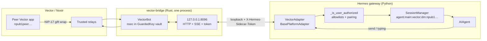

# hermes-vector-platform

[](LICENSE)
[](https://github.com/NousResearch/hermes-agent)

Standalone **Vector** ([vectorapp.io](https://vectorapp.io)) messaging gateway for [Hermes Agent](https://github.com/NousResearch/hermes-agent).

The plugin is a **first-class Vector bot identity** (its own nsec/npub), not an impersonation of a human Vector account. Hermes talks to Vector users through a local Rust sidecar wrapping `vector-sdk`.

> **User plugin, not in-tree Hermes.** Install into `~/.hermes/plugins/vector-platform` and enable it. Platform name is `vector` (toolset `hermes-vector`). Plugin name is `vector-platform`.

## Prerequisites

- Hermes Agent with the platform plugin registry (current `main`)
- Rust **≥ 1.75** (`cargo`, `rustc`). The sidecar depends on crates.io [`vector_sdk`](https://crates.io/crates/vector_sdk) `=0.9.0` (the last publish whose git SHA is on [VectorPrivacy/Vector](https://github.com/VectorPrivacy/Vector) `master`). No local Vector checkout.
- **Your** Vector npub (hex / `npub1` / `nostr:npub1`) to allowlist during setup

The bot identity is created or imported by `hermes gateway setup`. You do not need one before install.

## Install

Clone this repository into the Hermes plugins directory:

```bash
git clone https://github.com/BonesGit/hermes-vector-platform ~/.hermes/plugins/vector-platform
hermes plugins enable vector-platform
hermes gateway setup    # builds vector-bridge, create/import identity
hermes gateway restart
```

Confirm discovery:

```bash
hermes plugins list
```

### pip (optional)

Ships the adapter, `plugin.yaml`, and the sidecar **sources**. You still need Rust — there is no prebuilt `vector-bridge`. Prefer an editable install so `hermes gateway setup` can write `bridge/target/release/` in the checkout rather than in site-packages.

```bash
pip install -e /path/to/hermes-vector-platform
hermes plugins enable vector-platform
```

Entry point group: `hermes_agent.plugins` → `vector-platform = hermes_vector_platform:register`. A non-editable `pip install .` also includes `bridge/src` and `plugin.yaml`; it used to ship only a bare `adapter` module.

## Setup

```bash
hermes gateway setup
# pick Vector → create or import identity, enter YOUR Vector npub
hermes gateway restart
```

Setup will:

1. Resolve `vector-bridge` (`VECTOR_BRIDGE_BIN` or `bridge/target/release/vector-bridge`). If missing, `cd bridge && cargo build --release` (Rust ≥ 1.75). Build happens **only** in setup, never at `hermes gateway start`.
2. Run `--check` (read-only) against `VECTOR_DATA_DIR` (default `plugin-data/vector-platform/sdk`).
3. Create a new identity, or import an existing one (nsec **or** 12-word mnemonic). Secrets go through a temp `0600` file, never the sidecar env. **Do not** save nsec or mnemonic to `.env`.
4. Require **your** Vector npub (`hex` / `npub1` / `nostr:npub1`) as `VECTOR_HOME_CHANNEL` and the first `VECTOR_ALLOWED_USERS` entry.
5. Save only `VECTOR_NPUB`, `VECTOR_HOME_CHANNEL`, and `VECTOR_ALLOWED_USERS` to `.env`. Profile, communities, and pairing go in `config.yaml` `vector:`.
6. Merge `display.platforms.vector` (and the `vector:` block) into `~/.hermes/config.yaml` (see below).

Share the bot npub with contacts. Restart the gateway.

### Identity files

Both live under `VECTOR_DATA_DIR` (default `~/.hermes/plugin-data/vector-platform/sdk/`), mode `0600`. Replacing `identity.nsec` **is** a new bot.

| File | When it is written | Needed to run? |
|------|--------------------|----------------|
| `identity.nsec` | **Create** and **import** (from nsec or from mnemonic). | **Yes.** The sidecar loads this on every start and will not mint a replacement. Delete it and the bot will not start until you re-run setup and import from a backup. |
| `identity.mnemonic` | **Create**, and **mnemonic import** (the phrase is copied here). Nsec-only import cannot invent a seed, so this file is omitted. | **No.** Runtime never reads it. After you have an offline copy you can delete it; the bot keeps working as long as `identity.nsec` stays. |

On import you enter **either** the nsec or the mnemonic — not both. Mnemonic import writes both files; nsec import writes only `identity.nsec`.

## Architecture



`VectorAdapter.connect()` generates a spawn-time `X-Hermes-Sidecar-Token`, starts `vector-bridge` with `stdin=PIPE` + `VECTOR_SIDECAR_WATCH_STDIN=1` (parent-death), polls authenticated `GET /health` until `status=ready`, then subscribes to `GET /events` (SSE). DMs map as `chat_id = user_id = peer npub`.

**SSE delivery.** The adapter tracks the last event id it finished dispatching and sends it as `Last-Event-ID` when the stream reconnects. The sidecar retains the most recent 256 items and replays everything after that point, so a dropped stream recovers the gap instead of losing it. A resume id older than the retained window replays the whole window (inbound dedup absorbs the overlap); a fresh connect with no resume point replays nothing, so a gateway restart does not re-run old turns. Anything no live client accepted is logged with its id and counted in `GET /health` as `sse_dropped` (`sse_retained` is the current replay depth). The missed-DM cursor advances only on real delivery, so anything replay cannot cover is still ❌'d by the catch-up.

**Replay costs one turn per chat, not one per message.** A peer who fires off six messages into a dead stream is waiting on an answer to the last one, and six agent turns is six times the GPU. So replay is shaped before it is delivered: messages past the age horizon are skipped, the batch is capped, and every replayed message that a newer one in the same chat supersedes is flagged `superseded`. The adapter files those in the session transcript as context (no turn) and runs only the newest per chat. Skipped messages keep their cursor untouched, so they surface as ❌ catch-up marks rather than vanishing. Tune it under `vector.replay` in `config.yaml` (see below).

Hermes narrows this further on its own: `_pending_messages` holds **one** pending event per session, and the default busy mode is `interrupt`, so even a burst that does reach it collapses rather than stacking.

## Environment variables

Hermes pairing and cron need these in `~/.hermes/.env`. Setup writes only these three — not secrets, not defaults.

| Variable | Required | Purpose |
|----------|----------|---------|
| `VECTOR_NPUB` | yes | Bot public key (`npub1…`); written by setup |
| `VECTOR_ALLOWED_USERS` | recommended | Comma-separated npubs allowed to **DM** the bot. Also grants community turns. Pairing is DM-only. `hermes pairing approve` writes back here. |
| `VECTOR_HOME_CHANNEL` | for cron | Operator npub for cron and join notices (channel ids) |

Do **not** put `nsec` or a mnemonic in `.env`. Import through the setup prompt; identity lives in `sdk/identity.nsec` (and optional `sdk/identity.mnemonic`).

Sidecar plumbing stays getenv overrides (not in `plugin.yaml`, not written by the wizard): `VECTOR_DATA_DIR` (default `plugin-data/vector-platform/sdk`), `VECTOR_BRIDGE_BIN`, `VECTOR_BRIDGE_HOST` (default `127.0.0.1`), `VECTOR_BRIDGE_PORT` (default `8096`), `VECTOR_STARTUP_TIMEOUT` (default `60`; the plugin floors `HERMES_GATEWAY_PLATFORM_CONNECT_TIMEOUT` to `90` when that env is unset).

`VECTOR_SIDECAR_TOKEN` is generated at spawn time. Never put nsec in the sidecar environment or in the plugin install tree. Legacy `VECTOR_*` keys for profile / communities / pairing still win over YAML if you already set them.

## `config.yaml` (`vector:`)

Profile, communities, reactions, replay, and pairing live here. Env still overrides if set. Setup writes non-default answers; omit a key to keep the code default.

```yaml
# ~/.hermes/config.yaml
vector:
  bot:
    name: "Hermes"                   # public kind-0; omit = do not publish a name
    about: "Hermes on Vector"        # omit = do not publish about
    # avatar/banner: files at sdk/avatar.* / sdk/banner.* if present
  unauthorized_dm_behavior: ignore   # omit (default pair) = pairing codes
  reactions: false                   # 👀/✅/❌ on the triggering DM; default off
  missed_react: true                 # ❌ on DMs that arrived while the sidecar was down
  slash_commands: true               # Vector / picker (kind 10304); typed /approve still works
  replay:                            # how much backlog a reconnect is allowed to cost
    max_messages: 5                  # items replayed per reconnect, newest first; 0 = never replay
    max_age_secs: 600                # skip messages older than this; 0 = no age limit
  communities:
    create: false                    # true = bot-owned private home room after Ready
    name: Hermes                     # only used when create is true
    download_all: false              # true = download every group file on arrival
    invite_policy: whitelist         # whitelist | manual (public is refused)
    group_allowed_users: []          # npubs who may @mention without DM access
    open_channels: []                # 64-hex channel ids; any member may @mention / reply
    trusted_inviters: []             # empty = VECTOR_ALLOWED_USERS
```

Display / tool-progress stays under `display.platforms.vector` (next section).

## Display / tool progress

Vector edits in place (`POST /edit` → `Channel::edit`). Hermes tool-progress **accumulates on one bubble** (`tool_progress: new`). Token streaming stays off — each edit is another NIP-17 gift wrap. Setup merges `display.platforms.vector` (comment-preserving when `ruamel.yaml` is available; otherwise a full dump of `config.yaml`):

```yaml
# ~/.hermes/config.yaml
display:
  platforms:
    vector:
      tool_progress: new
      interim_assistant_messages: false
      long_running_notifications: false
      busy_ack_detail: false
      streaming: false
```

There is no `display.platform_tool_progress` key. Without the YAML override the plugin inherits Hermes' global `tool_progress: all` (still edited in place, just noisier). Vector **does** render markdown. Setup still writes this block when you decline “Reconfigure Vector?” so a pre-existing `VECTOR_NPUB` gets the same override. Re-run `hermes gateway setup` (skip reconfigure) to flip an older `tool_progress: off` install.

Session titles use the peer’s public kind-0 **name** (then `display_name`) via sidecar `GET /profile?npub=`. No card → truncated npub. Concord rooms use the **community** name (what Vector shows in the chat list). The default channel `general` is omitted; extra rooms append ` · channel`. Inbound `user_name` uses the last fetched label; this is not a live subscription to profile edits.

## Default-deny inbox

`VECTOR_ALLOWED_USERS` + Hermes pairing codes (default **on**). Setup requires the operator npub as the first allowlisted user. `hermes pairing approve` writes back into `VECTOR_ALLOWED_USERS`.

Set `vector.unauthorized_dm_behavior: ignore` in `config.yaml` to drop unauthorized senders **before** `handle_message`, so pairing codes are not sent. Leave pairing on unless you want a closed allowlist with no CLI approve path.

**Communities:** invite the bot from a trusted npub (`VECTOR_ALLOWED_USERS`, or `vector.communities.trusted_inviters`) and it auto-joins. It then listens in that room — no channel id in `.env`. A turn still needs an @mention, a reply-to-bot, or a registered slash command (`@everyone` never counts). The sender is allowed if they have DM access (`VECTOR_ALLOWED_USERS`), they are in `vector.communities.group_allowed_users` (group-only, no DM), or the channel is in `vector.communities.open_channels`. Pairing is **not** offered in a channel.

## Communities

Concord communities are E2E encrypted group spaces with channels. A **fresh community is private** (direct gift-wrapped invites only). Minting a public invite link is what flips Concord to public mode — this plugin does **not** mint those links.

**Join-first (smallest path):**

1. In the Vector app, create a community and **direct-invite** the bot npub (`VECTOR_NPUB`).
2. The sidecar auto-accepts only if the inviter is in `vector.communities.trusted_inviters` or `VECTOR_ALLOWED_USERS`. Anyone else stays parked (`invite_policy: manual` parks everyone).
3. Hermes only runs a turn on **@mention** (`@npub1…`, `nostr:npub1…`, `@` plus the bot's published name), **reply to a bot message**, or a **registered slash command** (`/approve`, `/deny`, …). `@everyone` is ignored.
4. Who may trigger that turn: `VECTOR_ALLOWED_USERS` (DM list, also groups), `vector.communities.group_allowed_users` (group-only, no DMs), or any member if the channel is in `vector.communities.open_channels`. Hermes session key is `agent:main:vector:group:<channel-hex>`.

The Vector app does not display channel ids. When the bot joins (trusted invite, `vector.communities.create`, connect-time membership sync, or a home-DM `/join`) it logs the full 64-hex `channel_id` and DMs `VECTOR_HOME_CHANNEL` a copy-pasteable notice. Restart does not re-DM the same id (`sdk/notified-channels.json`). Parked (untrusted) invites stay **silent** — no home DM when they land. List, join, or decline them from the home DM with `/invites`, `/join <community_id>`, `/decline <community_id>` (not on the `/` picker).

**Bot-owned home room:** set `vector.communities.create: true`. After Ready the sidecar creates or reuses a private community, persists `sdk/home-community.json` (restart will not create a second one), and direct-invites `VECTOR_ALLOWED_USERS`. No public invite URL, and the new channel is **not** written into `open_channels`. Direct-invited allowlisted members can already @mention; anyone else needs `group_allowed_users` or the channel id in `open_channels`.

Community **reactions** and missed-❌ catch-up stay DM-only. Missed Concord
messages while the sidecar was down are **ignored** (no ❌, no Hermes turn).
Concord channels are text, slash commands, and **file attachments**. The Vector
app sends group files with no caption and no @mention on that event. Default: the bot stashes
metadata and **does not download** until someone **replies to that file** and
@mentions the bot. A mention-only reply stores the file (session breadcrumb, no
AI turn). Extra text on that reply starts a turn with `media_urls`. Set
`vector.communities.download_all: true` to download every group file on arrival
(still silent in the room); the same reply+mention flow starts a turn.

## Slash commands

The sidecar publishes a Vector **kind 10304** command manifest so the app `/`
picker lists **`/approve` and `/deny` only**. Optional args are a trailing
string (`/approve session`, `/approve all always`, `/deny all`). The sidecar
SSE-forwards the original text to Hermes.

| Command | Arguments |
|---------|-----------|
| `/approve` | `once` (default), `session`, `always`, `all`, `all session`, `all always` |
| `/deny` | optional `all` and/or a reason |

In a Concord channel these do **not** need an @mention (the people-gate still
applies). Chatter that is not a registered command stays mention-gated.
`vector.slash_commands: false` skips publishing the picker; typed `/approve` in a
DM still reaches Hermes as plain text. This is **not** Concord kick/ban/invite
— those stay operator tools, not room slash commands.

## Block list and deletes

**Mute a DM peer** (Vector's block list, not a Concord kick/ban). Only from
the **`VECTOR_HOME_CHANNEL` DM** (your npub talking to the bot), type:

| Command | Effect |
|---------|--------|
| `/block <npub>` | Mute that peer. Their DMs are dropped (no pairing, no turn). |
| `/unblock <npub>` | Unmute. |
| `/blocked` | List muted npubs. |

These are **not** on the Vector `/` picker. The sidecar also exposes
`POST /block` `{npub, unblock?}` and `GET /block`. Blocking the bot or
yourself is refused.

**Parked community invites** (untrusted inviter, or `vector.communities.invite_policy: manual`).
They stay silent — the home channel is never pinged when something parks.
Only from the **`VECTOR_HOME_CHANNEL` DM**, type:

| Command | Effect |
|---------|--------|
| `/invites` | List parked rows (`community_id`, name, inviter). |
| `/join <community_id>` | Accept and join. Replies with `channel_id:` lines (same as a trusted auto-join). Does **not** add the inviter to `VECTOR_ALLOWED_USERS`. |
| `/decline <community_id>` | Drop the parked row without joining. |

Not on the Vector `/` picker. Sidecar: `GET /invites`,
`POST /invites/accept` `{community_id}`, `POST /invites/decline` `{community_id}`.

**Retract a bot message:** Hermes calls `delete_message` → `POST /delete`
`{to, message_id}` → `Channel::delete` (DM or Concord). Used for ephemeral
TTL and stream-preview cleanup.

**Inbound deletes:** `BotEvent::Delete` is SSE `message_delete`. The adapter
forgets last-inbound / pending-file pointers for that id and does **not**
start a Hermes turn.

## Files / attachments

Inbound files from allowlisted peers are decrypted into:

```text
~/.hermes/plugin-data/vector-platform/files/inbox/{npub}/{YYYY-MM-DD}/
~/.hermes/plugin-data/vector-platform/files/inbox/{channel-id}/{npub}/{YYYY-MM-DD}/
```

(DMs use the peer npub path; community files nest under the 64-hex channel id.) A sibling `.meta.json` and an append-only `files/index.jsonl` record original name, size, mime, and Vector event id. **No outbox copies** — files Hermes sends you exist only on Vector.

- **File, no caption (DMs):** saved, Vector ack (`saved notes.pdf`), and a session breadcrumb (so a later “process the pdf I sent” can see the path). The AI turn is **not** started. Sequential files from the same peer accumulate until the next text, which is attached as `media_urls`.
- **File + text (DMs):** saved, then a normal Hermes turn with `media_urls` (images → vision, voice → STT, documents → path note).

**DMs:** unauthorized senders are not downloaded. File-only DMs are saved, acked, and breadcrumbed (no AI turn) until the next text.

**Communities:** the Vector app cannot @mention on a file send. Default (`download_all` off): stash attachment metadata; **download only when a people-gated member replies to that file and @mentions the bot**. Mention-only reply → silent store + session breadcrumb, no turn. Mention + extra text → turn with `media_urls`. `vector.communities.download_all: true` downloads every group file on arrival (no room ack); reply+mention still starts the turn. Outbound `send_image` / `send_document` / video / voice already target the channel.

## Cron delivery

```text
deliver=vector
```

Uses `VECTOR_HOME_CHANNEL` (via `cron_deliver_env_var`) and `standalone_sender_fn`, which POSTs to the live sidecar `/send` with `X-Hermes-Sidecar-Token` from `~/.hermes/runtime/vector-sidecar.json` (mode `0600`, written on connect).

**Requirement:** the Hermes **gateway must be running** so `vector-bridge` is up. Cron in a separate process does not spawn its own sidecar.

## Development

```bash
# from the plugin root
pytest -q            # needs Hermes on PYTHONPATH, HERMES_AGENT_ROOT, or ~/.hermes/hermes-agent
cd bridge && cargo test --locked
```

Tests load `adapter.py` as a free module and do **not** construct `Platform("vector")` — `_missing_()` only succeeds once the registry has the plugin.

HTTP sidecar tests set `VECTOR_STUB=1` so they bind localhost HTTP **without** `VectorBot::build` (no live relays). Adapter unit tests mock that HTTP sidecar (no live Vector network). Production `connect()` does **not** set `VECTOR_STUB`. Production serve requires `VECTOR_DATA_DIR` with an existing `identity.nsec` (`--setup` already wrote it) and runs `VectorBot` with `InvitePolicy::Whitelist` (from `VECTOR_ALLOWED_USERS` / `vector.communities.trusted_inviters`) unless `invite_policy: manual`. Do not set `VECTOR_STUB` in the gateway.

## Live DM test (manual)

CI does not talk to Vector relays. After the sidecar is built, identity exists, and the gateway is running:

1. Put **your** Vector npub in `VECTOR_ALLOWED_USERS` (and `VECTOR_HOME_CHANNEL`). Unknown npubs are default-denied; with pairing on they get a Hermes pairing code instead of a turn.
2. Share the bot npub (`VECTOR_NPUB`) with that allowlisted peer.
3. From the Vector app, DM the bot. Hermes session key is `agent:main:vector:dm:<peer-npub>`.
4. The bot reply is `POST /send` `{to: <peer-npub>, body}` with `X-Hermes-Sidecar-Token`.

If inbound is silent: check `~/.hermes/logs/vector-bridge.log`, that `/health` is `ready`, and that the peer npub is allowlisted (not the bot's own npub).

## Live community test (manual)

1. Create a community in the Vector app and direct-invite the bot. Confirm `vector-bridge.log` shows `community invite` (auto-join if you are allowlisted). You should get a DM from the bot with `channel_id: <64-hex>` (needed for `vector.communities.open_channels`).
2. In that channel, `@mention` the bot (or reply to a bot message, or `/approve` / `/deny` from the `/` picker). Hermes session key is `agent:main:vector:group:<channel-hex>`. Unmentioned chatter must not start a turn.
3. Drop a file in the channel (no mention on that send — Vector has none). Default: it is **not** downloaded yet. Reply to that file bubble and `@mention` the bot: mention-only stores it (no turn); add a question in the reply to start a turn with `media_urls`. `vector.communities.download_all: true` saves files on arrival. Ask Hermes to send a file back — it should land in the channel, not a DM.
4. A random npub inviting the bot into another community must stay parked (not on the whitelist) — no join DM. From the home DM, `/invites` lists it; `/join <community_id>` / `/decline <community_id>` act on it.

## Security notes

- Sidecar binds **127.0.0.1** by default; every route except `/live` requires `X-Hermes-Sidecar-Token`
- nsec lives at `<VECTOR_DATA_DIR>/identity.nsec` (`0600`), never in `.env` at runtime. That file **is** required to start. `identity.mnemonic` is an optional backup (create / mnemonic import only) and is not read at runtime.
- `nsec1…` is registered as a Hermes redaction pattern; adapter logs truncate npub (`npub1abcd…`)
- Runtime record `~/.hermes/runtime/vector-sidecar.json` is `0600` and deleted on disconnect
- Keep `VECTOR_ALLOWED_USERS` tight on personal bots
- Back up `identity.nsec` (required) and `identity.mnemonic` (if present) offline; replacing the nsec **is** a new bot

## Troubleshooting

Operator checks — use this table and `hermes gateway status`. There is **no** `hermes doctor` coverage for this plugin.

| Symptom | Check |
|---------|--------|
| Plugin not listed | `hermes plugins enable vector-platform` then `hermes plugins list` |
| Invalid npub / allowlist ignored | hex, `npub1…`, or `nostr:npub1`. Bech32 charset is `qpzry9x8gf2tvdw0s3jn54khce6mua7l` — no `1`, `b`, `i`, `o` in the payload. `normalize_npub()` is the source of truth (not a loose regex). |
| `vector-bridge` binary not found | `VECTOR_BRIDGE_BIN` or `bridge/target/release/vector-bridge`. Run `hermes gateway setup` (`cd bridge && cargo build --release`). `hermes gateway start` does **not** compile Rust. |
| Identity missing / “will not mint” | `identity.nsec` is missing from `VECTOR_DATA_DIR` (default `~/.hermes/plugin-data/vector-platform/sdk`). Restore it or re-run setup and import. Start never mints. Deleting `identity.mnemonic` does **not** cause this. |
| Port 8096 in use | `ss -ltnp \| rg 8096` or set `VECTOR_BRIDGE_PORT`. A leftover `vector-bridge` is reaped on connect; a foreign process is a retryable fatal. |
| Lost the bot / contacts don't recognize it | Restoring needs `identity.nsec` **or** `identity.mnemonic`. Replacing the nsec **is** a new bot (new npub, lost DMs). Identities minted before mnemonic-on-create, or imported from nsec only, have no seed file. |
| Sidecar is a stub / no live DMs | `VECTOR_STUB` must **not** be set in the gateway. Production `connect()` strips it. Only HTTP unit tests set it (binds without `VectorBot::build`). |
| Missed DMs while the sidecar was down | Not sent to the agent. After Ready the sidecar reacts ❌ on allowlisted DMs newer than `sdk/missed-seen.json`. First boot only seeds the cursor. `vector.missed_react: false` disables. Missed **community** messages are ignored (no ❌, no turn). Agent react/unreact and optional 👀/✅/❌ acks: see `vector.reactions`. |
| DM with no reply, sidecar still up | A dropped SSE stream is replayed from `Last-Event-ID` (256-item window), so this should self-heal. Check `sse_dropped` in `GET /health` — non-zero means events outran the window; `~/.hermes/logs/vector-bridge.log` logs each drop with its id. Undelivered DMs stay unseen in `sdk/missed-seen.json` and get a ❌ on the next sidecar start. |
| Group messages ignored | The bot must have **joined** (trusted inviter). Then the sender needs `VECTOR_ALLOWED_USERS`, `vector.communities.group_allowed_users`, or the channel in `open_channels`. Mentions (`@bot npub` / `@` display name), a reply to the bot, or a registered slash command (`/approve`, `/deny`, …) are required; `@everyone` is ignored. Pairing is not sent in groups. Group files download when you **reply to the file and @mention** the bot (or set `download_all: true`). |
| Slash `/approve` missing from the Vector picker | Sidecar must be rebuilt after this feature (`hermes gateway setup` / `cargo build --release` in `bridge/`). `vector.slash_commands` must not be `false`. Kind-10304 publishes in the background after `BotEvent::Ready` (does not block gateway start). Type `/` in a chat with the bot. Typed `/approve` in a DM works even without the picker. |
| Bot not joining a community | Inviter npub must be in `trusted_inviters` or `VECTOR_ALLOWED_USERS`. `invite_policy: manual` parks all invites. Parked invites do not ping home — type `/invites` in the `VECTOR_HOME_CHANNEL` DM, or check `/health` `pending_invites`. |
| Cron `deliver=vector` fails | Gateway must be running. Cron reads `~/.hermes/runtime/vector-sidecar.json` (`0600`, port + token). |
| Gateway / sidecar status | `hermes gateway status`; `~/.hermes/logs/vector-bridge.log`. Logger is `hermes_plugins.vector_platform.adapter`. |

## License

MIT — see [LICENSE](LICENSE).

See also [CHANGELOG.md](CHANGELOG.md) for release history.
