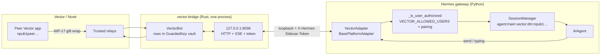

# hermes-vector-platform

[](LICENSE)
[](https://github.com/NousResearch/hermes-agent)

Standalone **Vector** ([vectorapp.io](https://vectorapp.io)) messaging gateway for [Hermes Agent](https://github.com/NousResearch/hermes-agent).

The plugin is a **first-class Vector bot identity** (its own nsec/npub), not an impersonation of a human Vector account. Hermes talks to Vector users through a local Rust sidecar wrapping `vector-sdk`.

> **User plugin, not in-tree Hermes.** Install into `~/.hermes/plugins/vector-platform` and enable it. Platform name is `vector` (toolset `hermes-vector`). Plugin name is `vector-platform`.

## Install

```bash
git clone <this-repo> ~/.hermes/plugins/vector-platform
hermes plugins enable vector-platform
```

Confirm discovery:

```bash
hermes plugins list
```

`hermes gateway setup` for Vector (identity create/import + sidecar build) lands in a later PR. Until then the plugin registers the `vector` platform so pairing allowlists (`VECTOR_ALLOWED_USERS`) and npub helpers are already in place.

### Option B — pip entry point

```bash
pip install -e /path/to/hermes-vector-platform
hermes plugins enable vector-platform
```

Entry point group: `hermes_agent.plugins` → `vector-platform = adapter:register`.

## Prerequisites

- Hermes Agent with the platform plugin registry (current `main`)
- Rust **≥ 1.75** and a sibling [Vector](https://github.com/VectorPrivacy/Vector) checkout (needed when the sidecar crate ships)
- A Vector bot identity created or imported by setup (writes `sdk/identity.nsec`, mode `0600`)

## Architecture



```
Vector app  ↔  Relays  ↔  vector-bridge (Rust / vector-sdk)
                              ↕ HTTP/SSE 127.0.0.1:8096
                         VectorAdapter (this plugin)
                              ↕
                         Hermes gateway / AIAgent
```

The sidecar is **not shipped in this skeleton**. `connect()` does not spawn a process yet.

## Environment variables

| Variable | Required | Purpose |
|----------|----------|---------|
| `VECTOR_NPUB` | yes | Bot public key (`npub1…`); written by setup |
| `VECTOR_NSEC` | import only | Setup copies this into `sdk/identity.nsec`; sidecar never reads it. Delete from `.env` after setup. |
| `VECTOR_MNEMONIC` | import only | 12-word BIP-39 seed (NIP-06) |
| `VECTOR_ALLOWED_USERS` | recommended | Comma-separated npubs allowed to DM the bot |
| `VECTOR_ALLOW_ALL_USERS` | no | Dev-only open access (dangerous) |
| `VECTOR_HOME_CHANNEL` | for cron | Operator npub for cron / notification delivery |
| `VECTOR_BOT_NAME` | no | Display name (default `Hermes`) |
| `VECTOR_DATA_DIR` | no | Absolute path for Vector SDK data (default `plugin-data/vector-platform/sdk`) |
| `VECTOR_BRIDGE_PORT` | no | Local HTTP port for the Rust sidecar (default `8096`) |
| `VECTOR_BRIDGE_HOST` | no | Sidecar bind address (default `127.0.0.1`). LAN bind is a risk even with the token. |
| `VECTOR_BRIDGE_BIN` | no | Absolute path to `vector-bridge` |
| `VECTOR_STARTUP_TIMEOUT` | no | Seconds to wait for sidecar `/health status=ready` (default `30`) |
| `VECTOR_PAIRING` | no | `on` (default) = unknown npubs get a Hermes pairing code; `off` = drop them before `handle_message` |

`VECTOR_SIDECAR_TOKEN` is generated at spawn time and is **not** a plugin.yaml env var. Never put nsec in the sidecar environment or in the plugin install tree.

## Display / tool progress

Vector can edit messages, but v1 has no `/edit` route. Setup will write:

```yaml
# ~/.hermes/config.yaml
display:
  platforms:
    vector:
      tool_progress: off
      interim_assistant_messages: false
```

Without that override the plugin inherits Hermes' global `tool_progress: all` and would post a new Vector DM per tool event. Markdown **is** rendered — opposite of Session.

## Default-deny inbox

`VECTOR_ALLOWED_USERS` + Hermes pairing codes. `VECTOR_ALLOW_ALL_USERS` is dev-only. Authz env names are registered on `PlatformEntry` from day one so `hermes pairing approve` can write back into the allowlist as soon as setup exists.

## Development

```bash
cd hermes-vector-platform
pytest -q            # needs Hermes on PYTHONPATH, HERMES_AGENT_ROOT, or ~/.hermes/hermes-agent
cd bridge && cargo test --locked
```

Tests load `adapter.py` as a free module and do **not** construct `Platform("vector")` — `_missing_()` only succeeds once the registry has the plugin.

HTTP sidecar tests set `VECTOR_STUB=1` so they bind localhost HTTP **without** `VectorBot::build` (no live relays). Production serve requires `VECTOR_DATA_DIR` with an existing `identity.nsec` (`--setup` already wrote it) and runs `VectorBot` with `InvitePolicy::Manual`. Do not set `VECTOR_STUB` in the gateway.

## Security notes

- Sidecar binds **127.0.0.1** by default; every route except `/live` requires `X-Hermes-Sidecar-Token`
- nsec lives at `<VECTOR_DATA_DIR>/identity.nsec` (`0600`), never in `.env` at runtime
- `nsec1…` is registered as a Hermes redaction pattern
- Keep `VECTOR_ALLOWED_USERS` tight on personal bots
- Back up `sdk/identity.nsec` offline; replacing it **is** a new bot

## License

MIT — see [LICENSE](LICENSE).
