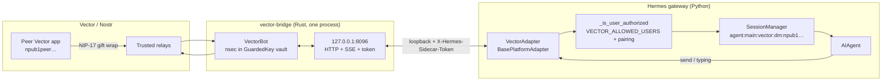

# hermes-vector-platform

[](LICENSE)
[](https://github.com/NousResearch/hermes-agent)

Standalone **Vector** ([vectorapp.io](https://vectorapp.io)) messaging gateway for [Hermes Agent](https://github.com/NousResearch/hermes-agent).

The plugin is a **first-class Vector bot identity** (its own nsec/npub), not an impersonation of a human Vector account. Hermes talks to Vector users through a local Rust sidecar wrapping `vector-sdk`.

> **User plugin, not in-tree Hermes.** Install into `~/.hermes/plugins/vector-platform` and enable it. Platform name is `vector` (toolset `hermes-vector`). Plugin name is `vector-platform`.

## Install

```bash
git clone <this-repo> ~/.hermes/plugins/vector-platform
hermes plugins enable vector-platform
hermes gateway setup    # builds vector-bridge, create/import identity
hermes gateway restart
```

Confirm discovery:

```bash
hermes plugins list
```

### Setup

```bash
hermes gateway setup
# pick Vector → create or import identity, enter YOUR Vector npub
hermes gateway restart
```

Setup will:

1. Resolve `vector-bridge` (`VECTOR_BRIDGE_BIN` or `bridge/target/release/vector-bridge`). If missing, `cd bridge && cargo build --release` (Rust ≥ 1.75). Build happens **only** in setup, never at `hermes gateway start`.
2. Run `--check` (read-only) against `VECTOR_DATA_DIR` (default `plugin-data/vector-platform/sdk`).
3. Create a new nsec, or import via a temp `0600` `--nsec-file` / `--mnemonic-file` (never put the secret in the sidecar env).
4. Require **your** Vector npub (`hex` / `npub1` / `nostr:npub1`) as `VECTOR_HOME_CHANNEL` and the first `VECTOR_ALLOWED_USERS` entry.
5. Save `VECTOR_NPUB`, `VECTOR_HOME_CHANNEL`, `VECTOR_ALLOWED_USERS`, `VECTOR_DATA_DIR`. **Do not** save nsec to `.env`.
6. Merge `display.platforms.vector` into `~/.hermes/config.yaml` (see below).

Share the bot npub with contacts. Back up `sdk/identity.nsec` offline — replacing it **is** a new bot. Restart the gateway.

### Option B — pip entry point

```bash
pip install -e /path/to/hermes-vector-platform
hermes plugins enable vector-platform
```

Entry point group: `hermes_agent.plugins` → `vector-platform = adapter:register`.

## Prerequisites

- Hermes Agent with the platform plugin registry (current `main`)
- Rust **≥ 1.75** (`cargo`, `rustc`) and a sibling [Vector](https://github.com/VectorPrivacy/Vector) checkout so `bridge/Cargo.toml`'s `../../Vector/crates/vector-sdk` path resolves
- A Vector bot identity created or imported by `hermes gateway setup` (writes `sdk/identity.nsec`, mode `0600`)

## Architecture



```
Vector app  ↔  Relays  ↔  vector-bridge (Rust / vector-sdk)
                              ↕ HTTP/SSE 127.0.0.1:8096
                         VectorAdapter (this plugin)
                              ↕
                         Hermes gateway / AIAgent
```

`VectorAdapter.connect()` generates a spawn-time `X-Hermes-Sidecar-Token`, starts `vector-bridge` with `stdin=PIPE` + `VECTOR_SIDECAR_WATCH_STDIN=1` (parent-death), polls authenticated `GET /health` until `status=ready`, then subscribes to `GET /events` (SSE). DMs map as `chat_id = user_id = peer npub`.

## Environment variables

| Variable | Required | Purpose |
|----------|----------|---------|
| `VECTOR_NPUB` | yes | Bot public key (`npub1…`); written by setup |
| `VECTOR_NSEC` | import only | Setup copies this into `sdk/identity.nsec`; sidecar never reads it. Delete from `.env` after setup. |
| `VECTOR_MNEMONIC` | import only | 12-word BIP-39 seed (NIP-06) |
| `VECTOR_ALLOWED_USERS` | recommended | Comma-separated npubs allowed to DM the bot |
| `VECTOR_ALLOW_ALL_USERS` | no | Dev-only open access (dangerous) |
| `VECTOR_HOME_CHANNEL` | for cron | Operator npub for cron / notification delivery |
| `VECTOR_BOT_NAME` | no | Display name (default `Hermes`) |
| `VECTOR_DATA_DIR` | no | Absolute path for Vector SDK data (default `plugin-data/vector-platform/sdk`) |
| `VECTOR_BRIDGE_PORT` | no | Local HTTP port for the Rust sidecar (default `8096`) |
| `VECTOR_BRIDGE_HOST` | no | Sidecar bind address (default `127.0.0.1`). LAN bind is a risk even with the token. |
| `VECTOR_BRIDGE_BIN` | no | Absolute path to `vector-bridge` |
| `VECTOR_STARTUP_TIMEOUT` | no | Seconds to wait for sidecar `/health status=ready` (default `25`). Must stay below `HERMES_GATEWAY_PLATFORM_CONNECT_TIMEOUT` (Hermes default `30`); raise both if Vector login needs longer. |
| `VECTOR_PAIRING` | no | `on` (default) = unknown npubs get a Hermes pairing code; `off` = drop them before `handle_message` |

`VECTOR_SIDECAR_TOKEN` is generated at spawn time and is **not** a plugin.yaml env var. Never put nsec in the sidecar environment or in the plugin install tree.

## Display / tool progress

Vector can edit messages, but v1 has no `/edit` route. Setup merges only the `display.platforms.vector` mapping (comment-preserving when `ruamel.yaml` is available; otherwise a full dump of `config.yaml`):

```yaml
# ~/.hermes/config.yaml
display:
  platforms:
    vector:
      tool_progress: off
      interim_assistant_messages: false
      long_running_notifications: false
      busy_ack_detail: false
```

There is no `display.platform_tool_progress` key. Without the YAML override the plugin inherits Hermes' global `tool_progress: all` and would post a new Vector DM per tool event. Markdown **is** rendered — opposite of Session. Setup still writes this block when you decline “Reconfigure Vector?” so a pre-existing `VECTOR_NPUB` gets the D12 override.

## Default-deny inbox

`VECTOR_ALLOWED_USERS` + Hermes pairing codes (`VECTOR_PAIRING` default **on**). Setup requires the operator npub as the first allowlisted user. `VECTOR_ALLOW_ALL_USERS` is dev-only. `hermes pairing approve` writes back into `VECTOR_ALLOWED_USERS`.

`VECTOR_PAIRING=off` drops unauthorized senders in the adapter **before** `handle_message`, so pairing codes are not sent. Leave pairing **on** unless you want a closed allowlist with no CLI approve path.

## Cron delivery

```text
deliver=vector
```

Uses `VECTOR_HOME_CHANNEL` (via `cron_deliver_env_var`) and `standalone_sender_fn`, which POSTs to the live sidecar `/send` with `X-Hermes-Sidecar-Token` from `~/.hermes/runtime/vector-sidecar.json` (mode `0600`, written on connect).

**Requirement:** the Hermes **gateway must be running** so `vector-bridge` is up. Cron in a separate process does not spawn its own sidecar.

## Development

```bash
cd hermes-vector-platform
pytest -q            # needs Hermes on PYTHONPATH, HERMES_AGENT_ROOT, or ~/.hermes/hermes-agent
cd bridge && cargo test --locked
```

Tests load `adapter.py` as a free module and do **not** construct `Platform("vector")` — `_missing_()` only succeeds once the registry has the plugin.

HTTP sidecar tests set `VECTOR_STUB=1` so they bind localhost HTTP **without** `VectorBot::build` (no live relays). Adapter unit tests mock that HTTP sidecar (no live Vector network). Production `connect()` does **not** set `VECTOR_STUB`. Production serve requires `VECTOR_DATA_DIR` with an existing `identity.nsec` (`--setup` already wrote it) and runs `VectorBot` with `InvitePolicy::Manual`. Do not set `VECTOR_STUB` in the gateway.

## Live DM test (manual)

CI does not talk to Vector relays. After the sidecar is built, identity exists, and the gateway is running:

1. Put **your** Vector npub in `VECTOR_ALLOWED_USERS` (and `VECTOR_HOME_CHANNEL`). Unknown npubs are default-denied; with pairing on they get a Hermes pairing code instead of a turn.
2. Share the bot npub (`VECTOR_NPUB`) with that allowlisted peer.
3. From the Vector app, DM the bot. Hermes session key is `agent:main:vector:dm:<peer-npub>`.
4. The bot reply is `POST /send` `{to: <peer-npub>, body}` with `X-Hermes-Sidecar-Token`.

If inbound is silent: check `~/.hermes/logs/vector-bridge.log`, that `/health` is `ready`, and that the peer npub is allowlisted (not the bot's own npub).

## Security notes

- Sidecar binds **127.0.0.1** by default; every route except `/live` requires `X-Hermes-Sidecar-Token`
- nsec lives at `<VECTOR_DATA_DIR>/identity.nsec` (`0600`), never in `.env` at runtime
- `nsec1…` is registered as a Hermes redaction pattern; adapter logs truncate npub (`npub1abcd…`)
- Runtime record `~/.hermes/runtime/vector-sidecar.json` is `0600` and deleted on disconnect
- Keep `VECTOR_ALLOWED_USERS` tight on personal bots
- Back up `sdk/identity.nsec` offline; replacing it **is** a new bot

## Troubleshooting

Operator checks — use this table and `hermes gateway status`. There is **no** `hermes doctor` coverage for this plugin.

| Symptom | Check |
|---------|--------|
| Plugin not listed | `hermes plugins enable vector-platform` then `hermes plugins list` |
| Invalid npub / allowlist ignored | hex, `npub1…`, or `nostr:npub1`. Bech32 charset is `qpzry9x8gf2tvdw0s3jn54khce6mua7l` — no `1`, `b`, `i`, `o` in the payload. `normalize_npub()` is the source of truth (not a loose regex). |
| `vector-bridge` binary not found | `VECTOR_BRIDGE_BIN` or `bridge/target/release/vector-bridge`. Run `hermes gateway setup` (`cd bridge && cargo build --release`). `hermes gateway start` does **not** compile Rust. |
| Identity missing / “will not mint” | `VECTOR_DATA_DIR` (default `~/.hermes/plugin-data/vector-platform/sdk`). `identity.nsec` must already exist from setup. Start never mints. |
| Port 8096 in use | `ss -ltnp \| rg 8096` or set `VECTOR_BRIDGE_PORT`. A leftover `vector-bridge` is reaped on connect; a foreign process is a retryable fatal. |
| Lost the bot / contacts don't recognize it | Back up `sdk/identity.nsec` offline. Replacing that file **is** a new bot (new npub, lost DMs). |
| Sidecar is a stub / no live DMs | `VECTOR_STUB` must **not** be set in the gateway. Production `connect()` strips it. Only HTTP unit tests set it (binds without `VectorBot::build`). |
| Missed DMs while the sidecar was down | v1 does **not** catch up. `sync_dms` ingests SQLite only and does not dispatch to Hermes. The peer retries. History catch-up is v1.1. |
| Cron `deliver=vector` fails | Gateway must be running. Cron reads `~/.hermes/runtime/vector-sidecar.json` (`0600`, port + token). |
| Gateway / sidecar status | `hermes gateway status`; `~/.hermes/logs/vector-bridge.log`. Logger is `hermes_plugins.vector_platform.adapter`. |

## License

MIT — see [LICENSE](LICENSE).

See also [CHANGELOG.md](CHANGELOG.md) for release history.
